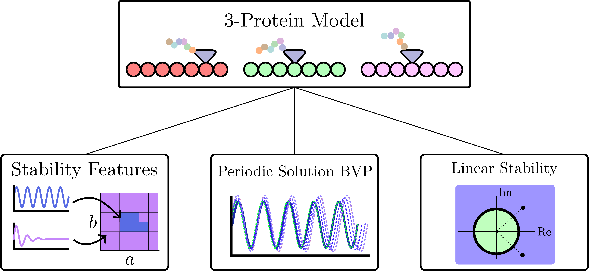

background-image: url("../../people/people.png")
background-size: 800px
background-position: 95% 50%
<!-- ------------------------------------------------------- -->
<!-- DO NOT REMOVE -->
```{r setup, include=FALSE}
library(knitr)
options(htmltools.dir.version = FALSE)
knitr::opts_chunk$set(echo = FALSE)
knitr::opts_chunk$set(fig.align = 'center')
```
<!-- ------------------------------------------------------- -->
<!-- Adjust collaborator image size and position (DO NOT INSERT ANY CODE ABOVE THIS)-->

# Acknowledgements 
.left-column[
<div style="height: 25px;"></div>
<p style="font-size:9px">&mdash;&mdash;&mdash;&mdash;&mdash;&mdash;&mdash;&mdash;&mdash;&mdash;&mdash;&mdash;&mdash;&mdash;&mdash;&mdash;&mdash;&mdash;&mdash;&mdash;&mdash;&mdash;&mdash;&mdash;&mdash;&mdash;&mdash;&mdash;&mdash;&mdash;</p>

<!-- Funding agency logo and grant number -->
```{r, out.width=500, fig.align='center'}
    knitr::include_graphics(c("../../logos/AFRL.png"))
```
<p style="text-align: left; font-size:20px">This material is based upon work supported by the Air Force Office of Scientific Research under award number FA9550- 30 22-1-0007</p>

<p style="font-size:9px">&mdash;&mdash;&mdash;&mdash;&mdash;&mdash;&mdash;&mdash;&mdash;&mdash;&mdash;&mdash;&mdash;&mdash;&mdash;&mdash;&mdash;&mdash;&mdash;&mdash;&mdash;&mdash;&mdash;&mdash;&mdash;&mdash;&mdash;&mdash;&mdash;&mdash;</p>
]

<!-----------------
  Script: 
  I would like to start by thanking the air force office of  scientific research for funding this project. I would also like to thank my collaborators Firas Khasawneh, Andreas Otto and Tomas Gedeon.
----------------->
---

# Protein Synthesis


--

--


<!-- Script %%%%%%%%%%%%%%%%%%%%%%%%%%%%%%%%%%%%%%%%%%%%%%%%%%%%%%%%%%%%%%%%%%%%%%-->
???

  An essential component in living cells is the ability to make proteins for the organism. This mainly occurs through protein synthesis in the cell where a pool of ribosomes utilize resources in the cell and traverse the messenger ribonucleic acid or mRNA strands. These strands contain the necessary code for synthesizing a protein and the ribosomes read this code to make the protein as the mRNA is traversed. 
  
  It has been observed in experimental settings that when the cell is starved of resources it will exhibit metabolic cycling where the protein production rates oscillate. 

  We aimed to model this process as a time delay system due to the metabolic cycling process taking approximately 40 minutes in experiments. 
  
  This animation demonstrates ribosomes traversing the mRNA for three proteins and when they reach the end the protein is produced.

  Here is an outline for this portion of the talk. I will show how we obtained a single protein model and show the three methods that we used for searching for limit cycles in this system.

  I will then show how we extended the model to include three coupled proteins with a shared resource pool and apply the same methods for analysis.
<!-- Script %%%%%%%%%%%%%%%%%%%%%%%%%%%%%%%%%%%%%%%%%%%%%%%%%%%%%%%%%%%%%%%%%%%%%%-->
---
class: left
# 1-Protein Model


- Ribosome Initiation: $\mu(t)=f(p(t))R(t)$

--

background-image: url("./assets/DISC_2023/hill.png")
background-size: 400px
background-position: 95% 35%

- Hill Function: $f(x)=\frac{x^n}{\kappa^n+x^n}$

--

- $\dot{p}(t) = B\mu(t-\tau) - Dp(t)$

--

- $R(t) = R_T - A\int_{t-\tau}^t\mu(s)ds$ $^1$
  <!-- - (Mier-y-Teran-Romero et al.) -->
.footnote[1.L. M. y Ter ́an-Romero, M. Silber, and V. Hatzimanikatis, “The origins of time-delay in template biopolymeriza-
tion processes,” PLoS Computational Biology, vol. 6, p. e1000726, apr 2010]
--

- $\dot{R}(t) = A(f(p(t-\tau))R(t-\tau) - f(p(t))R(t))$

--

Single Protein System:
\begin{align}
  \dot{p}(t) &= Bf(p(t-\tau))R(t-\tau) - Dp(t),\\
  \dot{R}(t) &= A(f(p(t-\tau))R(t-\tau) - f(p(t))R(t))
\end{align}

<!-- Script %%%%%%%%%%%%%%%%%%%%%%%%%%%%%%%%%%%%%%%%%%%%%%%%%%%%%%%%%%%%%%%%%%%%%%-->
???

We will now discuss how we obtained our model for this system. 
The rate of ribosome initiation is the product of the activator the f(p(t)) term and the processing  molecule or resource R(t). The activator is a hill function where if the input is sufficiently large its value approaches one and it is close to zero if the input is close to zero. The hill function parameters change the rate of initiation for the activation.  

The rate of protein production is then proportional to the initiation at some time tau seconds in the past where the delay is the required time for protein synthesis. The parameter B is the growth rate and we also include the decay term here with decay rate D.

The total resource equation has been suggested as this equation where the resource at any time t is given by the total resource minus the integral of the initiation over the production time tau. 

Differentiating this expression and using the initiation definition gives the second equation in our model and we write the single protein system as these two equations.

Note that when we differentiate this equation we limit the delays to constant delays and if state or time dependent delays are used this step is invalid.

<!-- Script %%%%%%%%%%%%%%%%%%%%%%%%%%%%%%%%%%%%%%%%%%%%%%%%%%%%%%%%%%%%%%%%%%%%%%-->
---
background-image: url("./assets/DISC_2023/eig_stability.png")
background-size: 350px
background-position: 80% 60%
# Linear Stability: Spectral Element Method
.footnote[Khasawneh, Firas A., and Brian P. Mann. "A spectral element approach for the stability analysis of time-periodic delay equations with multiple delays." 
Communications in Nonlinear Science and Numerical Simulation 18.8 (2013): 2129-2141.]

- Discretize system

--

- Approximate monodromy operator 

--

- $\vec{z}_n = \mathbf{U} \vec{z}_{n-1}$


--

$(p^*, R^*) = (p_{\text{trivial}},R_{\text{trivial}})=(0,R_T)$

$(p^*, R^*) = (p_{\text{middle}}, R_{\text{middle}})$

$(p^*, R^*) = (p_{\text{top}}, R_{\text{top}})$


<!-- Script %%%%%%%%%%%%%%%%%%%%%%%%%%%%%%%%%%%%%%%%%%%%%%%%%%%%%%%%%%%%%%%%%%%%%%-->
???
  The first method utilizes the spectral element method, however here we use the discrete map obtained from the discretization called the monodromy operator to map the states forward in time by one period. We use this finite approximation to compute the eigenvalues and evaluate the linearized system stability. If the eigenvalues have magnitude larger than 1 the system is unstable and less than 1 the system is stable. 

  The system has three equilibria. The trivial equilibrium results in no protein production and this point was found to be stable. We use this method on the nontrivial equilibria to study their stability.
<!-- Script %%%%%%%%%%%%%%%%%%%%%%%%%%%%%%%%%%%%%%%%%%%%%%%%%%%%%%%%%%%%%%%%%%%%%%-->


---

# Linear Stability: 1-Protein Results
- Fix parameters $(A=1, B=2, D=10, \kappa=0.5, n=2)$


--


--
<br><br><br><br><br><br><br><br><br><br>

- <font color=green>Hopf Bifurcation:</font> $R_T = 2.6449 \tau + 4.6323$

- <font color=red>Saddle Node Bifurcation:</font> $R_T=\sqrt{25(1+\tau)}$


<!-- Script %%%%%%%%%%%%%%%%%%%%%%%%%%%%%%%%%%%%%%%%%%%%%%%%%%%%%%%%%%%%%%%%%%%%%%-->
???
  Here I am showing the linear stability diagrams in the tau RT plane for the single protein system for the middle equilibrium. We see that the magnitude of the dominant eigenvalue for this system is always outside of the unit circle so this equilibrium is unstable in this region of the parameter space. 
  
  The red curve corresponds to a saddle node bifurcation curve where the top and middle equilibria collide and disappear leaving only the trivial equilibrium point in the white region which we know is stable. 

  Next, we plot the stability of the top equilibrium point and we see that for low delay and sufficient resource this point is stable, but as the protein production time increases this point loses stability before colliding with the middle equilibrium. The green curve where this point changes stability is a sub critical Hopf bifurcation. 

  We located the green curve using these numerical results where the eigenvalues leave the unit circle, and the saddle node curve was located analytically for this system. 
<!-- Script %%%%%%%%%%%%%%%%%%%%%%%%%%%%%%%%%%%%%%%%%%%%%%%%%%%%%%%%%%%%%%%%%%%%%%-->


---
# Single Protein Simulation

- Compute a feature $M: \mathbb{R}^n\rightarrow \mathbb{R}$ on the nonlinear simulations.

--

- Color a 2D projection of the parameter space using the feature.

- Amplitude: $M_A=\sum_{i=1}^n \frac{1}{2}\left(\max{(x_i(t))}-\min{(x_i(t))}\right)$
--

</br>


--


.footnote[Tu, T., Kudlicki, A., Rowicka, M., McKnight, S.: Logic of the yeast metabolic cycle: Temporal
compartmentalization of cellular processes. Science 310, (2005)]


<!-- Script %%%%%%%%%%%%%%%%%%%%%%%%%%%%%%%%%%%%%%%%%%%%%%%%%%%%%%%%%%%%%%%%%%%%%%-->
???
The second numerical method involved system simulations. Our goal was to simulate the system over a region of the parameter space and compute a feature for each simulation to detect oscillations. 

We do this by coloring a 2D projection of the parameter space by computing the amplitude of the signal using this equation where we sum the amplitudes for each system state. 

The idea here is that the amplitude feature will be approximately zero if the system is stable at those parameters and positive if the system is oscillating.

To simulate the system, we need to specify its behavior before t=0. We chose a history function that aligns with the experimental results where they starve the cell of all resources prior to the experiment. 
<!-- Script %%%%%%%%%%%%%%%%%%%%%%%%%%%%%%%%%%%%%%%%%%%%%%%%%%%%%%%%%%%%%%%%%%%%%%-->


---
# 1-Protein Amplitude Feature
- Fix remaining parameters $(A=1, B=2, D=10, \kappa=0.5, n=2)$
- Vary $\tau$ and $R_T$

--


--


--


<!-- Script %%%%%%%%%%%%%%%%%%%%%%%%%%%%%%%%%%%%%%%%%%%%%%%%%%%%%%%%%%%%%%%%%%%%%%-->
???
  We hold A, B, D, kappa, and n constant in the system and vary the delay and total resource. 

  Due to the constraint equation, we only need to specify one initial condition and the R0 value is then fixed by setting the total resource. We start by computing the amplitude feature for a range of p0 and total resource. A region forms separating the top and trivial steady states where the system oscillates, but we see that for sufficient p0 we do not need to worry about multi stability. We found that p0=10 worked for the remaining simulations.

  Next we fix p0=10 and let tau vary in the parameter space to visualize the oscillation region. To connect this figure with the one on the left, if we add a vertical slice it will cross the oscillation regions at the RT values from the left figure. 
  
  We see that a large oscillation region is present and we also observe oscillations prior to the hopf bifurcation curve which suggested that it is a subcritical hopf bifurcation. 

  We also studied a horizontal slice of this plot at RT=30 to obtain a more traditional bifurcation diagram and we see that as the delay varies we switch from a stable steady state response to limit cycle oscillations and around tau=10 for this total resource the top equilibrium changes to be unstable. 

  We were unable to compute the unstable connection between the stable branch and limit cycle branch numerically so it is not shown here. 

<!-- Script %%%%%%%%%%%%%%%%%%%%%%%%%%%%%%%%%%%%%%%%%%%%%%%%%%%%%%%%%%%%%%%%%%%%%%-->


---
background-image: url("./assets/DISC_2023/periodic_sol.png")
background-size: 550px
background-position: 90% 60%

# Nonlinear DDE Periodic Solution: Spectral Element Method
.pull-left[
\begin{align}
    f&=\frac{dx}{dt}-Tg(x(t),x(t-\tau/T))=0\\ 
    t&\in[0,1]\\
    x&(s) - x(s+1) = 0~
    s\in[-\tau/T,0]\\
    p&(x)=0
\end{align}


.footnote[Khasawneh, Firas A., David AW Barton, and Brian P. Mann. 
"Periodic solutions of nonlinear delay differential equations using spectral element method." 
Nonlinear dynamics 67 (2012): 641-658.]
]

<!-- Script %%%%%%%%%%%%%%%%%%%%%%%%%%%%%%%%%%%%%%%%%%%%%%%%%%%%%%%%%%%%%%%%%%%%%%-->
???
  The final method for verifying the presence of limit cycles was using the spectral element method to find periodic solutions to the nonlinear system. In this case we form a boundary value problem from the full nonlinear model and discretize the system using a finite dimensional map to map states forward by one period in time. We use simulation data as the initial point and newton iteration allows for convergence to the true periodic solution. We can also extract an approximation of the true period of the system with this method. 
<!-- Script %%%%%%%%%%%%%%%%%%%%%%%%%%%%%%%%%%%%%%%%%%%%%%%%%%%%%%%%%%%%%%%%%%%%%%-->


---

# Periodic Solution Results


--

--

--


<!-- Script %%%%%%%%%%%%%%%%%%%%%%%%%%%%%%%%%%%%%%%%%%%%%%%%%%%%%%%%%%%%%%%%%%%%%%-->
???
  To do this, we chose points in interesting regions of the amplitude plot here.

  First we take tau=12 and RT=50 and see that the periodic solution is essentially constant production for the cell but it drops breifly.

  If we decrease the total resource, we see that the solution is spending more of its period at zero production but spikes for some of the period. 

  Moving to a lower total resource we get a solution that is closer to the trivial equilibrium point so this suggests that the oscillation region forms as a transition between the two stable steady states of the system. 
<!-- Script %%%%%%%%%%%%%%%%%%%%%%%%%%%%%%%%%%%%%%%%%%%%%%%%%%%%%%%%%%%%%%%%%%%%%%-->


---

background-image: url("./assets/DISC_2023/no_signals.gif")
background-size: 850px
background-position: 50% 120%
# 3-Protein Model

\begin{equation}
    \begin{split}
        \dot{p_1}(t)&=B_1 f(p_2(t-\tau_1))f(p_3(t-\tau_1))R(t-\tau_1) - D_1 p_1,\\
        \dot{p_2}(t)&=B_2 f(p_1(t-\tau_2))R(t-\tau_2) - D_2 p_2,\\
        \dot{p_3}(t)&=B_3 f(p_1(t-\tau_3))R(t-\tau_3) - D_3 p_3,\\
        \dot{R}(t)&=A(\mu_1(t-\tau_1)+\mu_2(t-\tau_2)+\mu_2(t-\tau_3)-\mu_1(t)-2\mu_2(t)),
    \end{split}
\end{equation}

<!-- Script %%%%%%%%%%%%%%%%%%%%%%%%%%%%%%%%%%%%%%%%%%%%%%%%%%%%%%%%%%%%%%%%%%%%%%-->
???
  We also extend the model to include 3 coupled proteins and study how the system behaves under a shared resource pool. The system is now four dimensional and contains many more parameters. 
<!-- Script %%%%%%%%%%%%%%%%%%%%%%%%%%%%%%%%%%%%%%%%%%%%%%%%%%%%%%%%%%%%%%%%%%%%%%-->


---
count: false
background-image: url("./assets/DISC_2023/signals.gif")
background-size: 1200px
background-position: 50% 50%

# 3-Protein Temporal Shift

<!-- Script %%%%%%%%%%%%%%%%%%%%%%%%%%%%%%%%%%%%%%%%%%%%%%%%%%%%%%%%%%%%%%%%%%%%%%-->
???

I do not have time to cover the results from this model, but one of the significant observations occurred for very low total resource in this system where we observed a temporal shift in one of the production rate peaks. We think this could indicate a more efficient use of resources for the cell. Note that this animation is shown for proteins with different production times but the concept is the same.
<!-- Script %%%%%%%%%%%%%%%%%%%%%%%%%%%%%%%%%%%%%%%%%%%%%%%%%%%%%%%%%%%%%%%%%%%%%%-->


---
background-image: url("./assets/DISC_2023/3ptn_outline.png")
background-size: 800px
background-position: 50% 50%
# Thank you! Any questions?

</br></br></br></br></br></br></br></br></br></br></br></br></br></br></br>
**Chumley, M.M.**, Khasawneh, F.A., Otto, A. et al. A Nonlinear Delay Model for Metabolic Oscillations in Yeast Cells. Bulletin of Mathematical Biology 85, 122 (2023).

<!-- Script %%%%%%%%%%%%%%%%%%%%%%%%%%%%%%%%%%%%%%%%%%%%%%%%%%%%%%%%%%%%%%%%%%%%%%-->
???
  Thank you for your attention. I would be happy to go over more details in the poster session later today. Our paper is shown at the bottom and was recently published. 
<!-- Script %%%%%%%%%%%%%%%%%%%%%%%%%%%%%%%%%%%%%%%%%%%%%%%%%%%%%%%%%%%%%%%%%%%%%%-->


