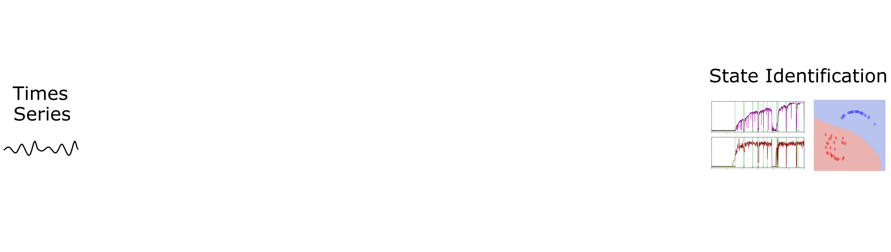
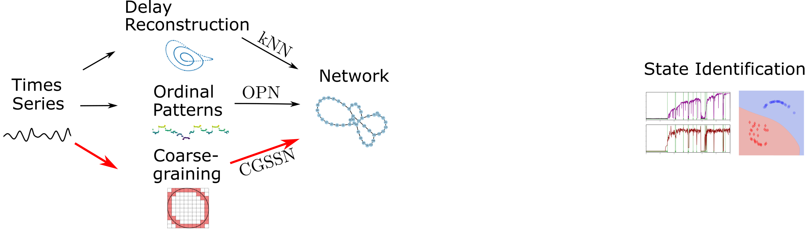
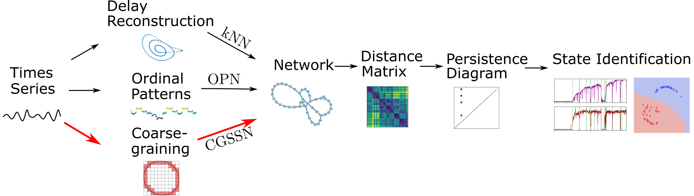
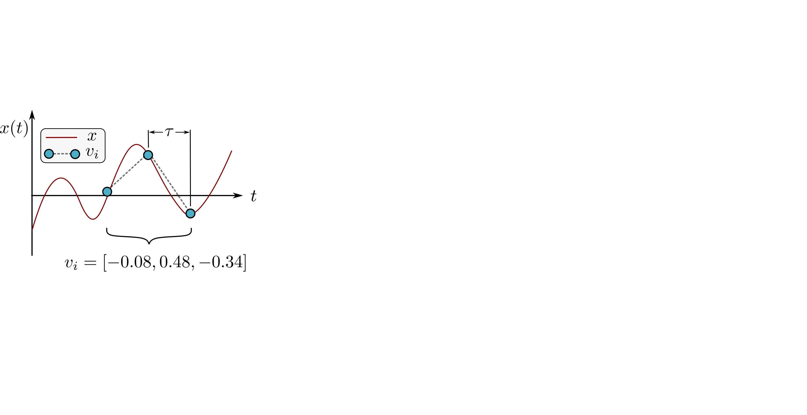
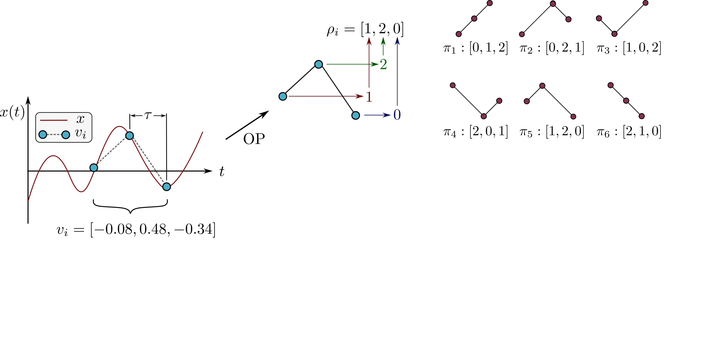
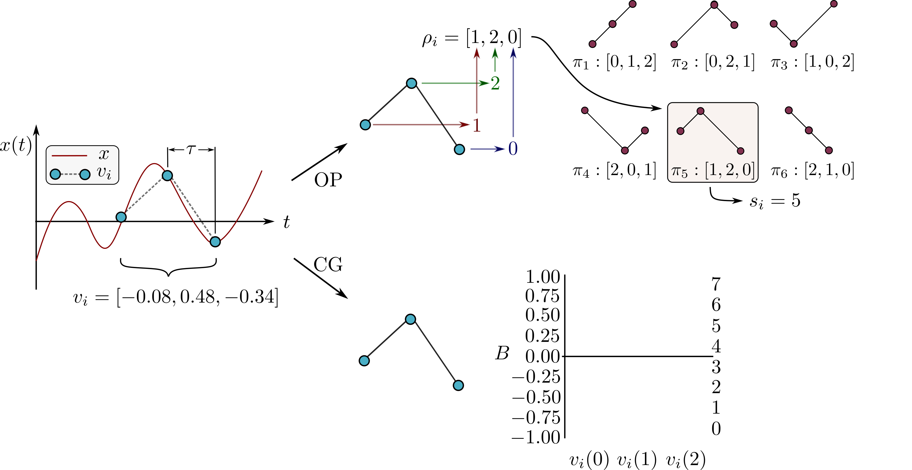
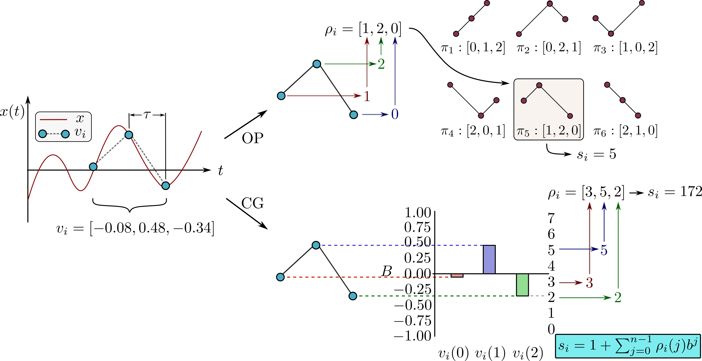
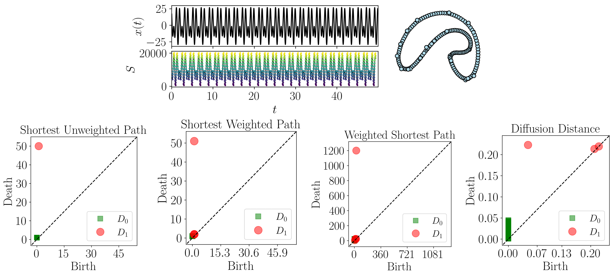

background-image: url("../../people/people.png")
background-size: 800px
background-position: 95% 50%

```{r setup, include=FALSE}
library(knitr)
options(htmltools.dir.version = FALSE)
knitr::opts_chunk$set(echo = FALSE)
knitr::opts_chunk$set(fig.align = 'center')
```
<!-- ----------------------------------------------------------------------------------------------------------------------------------------------- -->
<!-- Adjust collaborator image size and position (DO NOT INSERT ANY CODE ABOVE THIS)-->

# Acknowledgements 
.left-column[
<div style="height: 25px;"></div>
<p style="font-size:9px">&mdash;&mdash;&mdash;&mdash;&mdash;&mdash;&mdash;&mdash;&mdash;&mdash;&mdash;&mdash;&mdash;&mdash;&mdash;&mdash;&mdash;&mdash;&mdash;&mdash;&mdash;&mdash;&mdash;&mdash;&mdash;&mdash;&mdash;&mdash;&mdash;&mdash;</p>

<!-- Funding agency logo and grant number -->
```{r, out.width=500, fig.align='center'}
    knitr::include_graphics(c("../../logos/AFRL.png"))
```
<p style="text-align: left; font-size:20px">This material is based upon work supported by the Air Force Office of Scientific Research under award number FA9550- 30 22-1-0007</p>

<p style="font-size:9px">&mdash;&mdash;&mdash;&mdash;&mdash;&mdash;&mdash;&mdash;&mdash;&mdash;&mdash;&mdash;&mdash;&mdash;&mdash;&mdash;&mdash;&mdash;&mdash;&mdash;&mdash;&mdash;&mdash;&mdash;&mdash;&mdash;&mdash;&mdash;&mdash;&mdash;</p>
]

<!-----------------
  Script: 
  I would like to start by thanking the air force office of scientific research for funding this project. I would also like to thank my collaborators Audun Myers, Firas Khasawneh, and Elizabeth Munch.
----------------->
<!-- ----------------------------------------------------------------------------------------------------------------------------------------------- -->

---

# Pipeline




--


--



--


--



<!-----------------
  Script: 

  When analyzing a timeseries, many times it is easy for a human to distinguish a periodic signal from a chaotic one. However, characterizing these states automatically can be computationally expensive. A common approach for improving the efficiency of this process is to represent the timeseries as a network.  
  
  In our pipeline we have three methods for doing this, using a takens embedding to reconstruct the attractor, sequences of ordinal patterns and coarse graining of the state space which I will be discussing today. Using these approaches we get a network representation of the signal. 
  
  Once we have the network, we would like to study its topology for state identification and we do this by obtaining a distance matrix for the network and then using persistent homology to from topological data analysis to obtain a persistence diagram. The persistent diagram then allows for determining the dynamic state of the signal.  
----------------->

<!-- ----------------------------------------------------------------------------------------------------------------------------------------------- -->

---

# Motivation - Ordinal Partition Networks (OPN)


<!-----------------
  Script: 

  We will start by studying the ordinal partition network to motivate the need for the coarse grained state space network. The ordinal partition network or OPN for a timeseries signal is generated by setting a permutation dimension and delay to study the sequence of permutations as we move across the signal. 

  In this case our permutation dimension is 3 so we have 3 factorial or 6 possible states in our permutation sequence. Each state makes up a vertex in the network and transitions between those permutations make up an edge between two vertices. 
  
----------------->

<!-- ----------------------------------------------------------------------------------------------------------------------------------------------- -->
---

# Motivation - OPN Lorenz System 

- Lorenz System:

 $\frac{dx}{dt}  = \sigma (y-x), \\ \frac{dy}{dt}  = x(\rho-z), \\ \frac{dz}{dt}  = xy-\beta z$
- Timeseries: $x(t)$

--

- <font color=blue>Periodic:</font> $\sigma=10.0,~\beta=\frac{8}{3},~\rho=100$


--

- <font color=red>Chaotic:</font> $\sigma=10.0,~\beta=\frac{8}{3},~\rho=105$


<!-----------------
  Script: 

  For example we can generate OPNs for the lorenz system shown here. 

  If we take sigma as 10, beta as 8/3 and rho as 100 we get a periodic signal and our network shows a large single loop structure. 

  If we change rho to 105 instead of 100 the signal is chaotic and this qualitative idea is captured in the network by having many smaller loops and the network is tangled in a sense. 
  
----------------->
<!-- ----------------------------------------------------------------------------------------------------------------------------------------------- -->

---

# Motivation - OPN with Noise 
- Periodic Rossler System

 $\frac{dx}{dt}  = -y -z, \\ \frac{dy}{dt}  = x + ay, \\ \frac{dz}{dt}  = b + z(x-c)$

- $a=0.1,~b=0.2,~c=14$

- Timeseries: $z(t)$
--


--


--


--


<!-----------------
  Script: 
  
  The OPN method works well for many signals, but in the presence of noise the results can break down. For example we will use the periodic rossler system with the parameters shown and take the third timeseries as our signal. 

  The signal with no noise is shown in blue and its corresponding OPN with a large single loop. 

  Noise was then added to the signal at a signal to noise ratio of 30 dB which is considered relatively moderate noise. The corresponding OPN looks like a chaotic network in this case when the signal is still periodic. 
----------------->

<!-- ----------------------------------------------------------------------------------------------------------------------------------------------- -->
---
# Motivation - Undesired Transitions


<!-----------------
  Script: 
  
  This concept is demonstrated more generally in this picture. If the signal is close to the hyper diagonal at any point in the trajectory and noise is added to the system there can be undesired state transitions in the permutation sequence that drastically alter the resulting network. 
----------------->

<!-- ----------------------------------------------------------------------------------------------------------------------------------------------- -->
---

# Coarse-grained State Space Networks (CGSSN)


<!-----------------
  Script: 

  The coarse-grained state space or CGSSN method mitigates this issue by binning the state space into hypercubes and taking each hypercube to be a state in the network. 

  Here we show a simple sine wave and the generation of the CGSSN for this signal. 
  
----------------->
<!-- ----------------------------------------------------------------------------------------------------------------------------------------------- -->
---

# Network Formulation


--


--


--


--


--


--


--



<!-----------------
  Script: 
  
  Mathematically speaking, to formulate these networks we start with our timeseries signal and choose a permutation delay using the multiscale permutation entropy method and dimension using the false nearest neighbors method to slide across the signal.

  For ordinal partition networks we study the relative ordering of the permutation nodes to determine the state. In this case the ordering is 1 2 0 so this corresponds to group pi_5 and we set the state identifier s_i to be 5. 

  With CGSSNs, we use the same permutation group and bin the output of the signal. The heights of the permutation nodes are then mapped into these bins to determine the state vector and the state identifier is then computed by digitizing the state vector. In this case we are in state 172. 
----------------->
<!-- ----------------------------------------------------------------------------------------------------------------------------------------------- -->

---

# CGSSN with Noise 
- Periodic Rossler System

 $\frac{dx}{dt}  = -y -z, \\ \frac{dy}{dt}  = x + ay, \\ \frac{dz}{dt}  = b + z(x-c)$

- $a=0.1$
- $b=0.2$
- $c=14$

- Timeseries: $z(t)$
--


--


<!-----------------
  Script: 
  
  Going back to the same periodic rossler system example from before, we had the OPN results shown here and if we apply the CGSSN method to this signal the network is essentially the same as the periodic case showing that this method can be more robust to noise.

  In other words it is more difficult to obtain state transitions that drastically alter the topology of the network in the presence of noise. 
----------------->

<!-- ----------------------------------------------------------------------------------------------------------------------------------------------- -->
---

# Distance Matrix


<!-----------------
  Script: 
  To study the topology of the network using persistent homology, a distance matrix is required to describe the distances between points or vertices. First we need to define the methods for computing distance on a network for forming the distance matrix. 
----------------->
<!-- ----------------------------------------------------------------------------------------------------------------------------------------------- -->
---

# Graph Dissimilarity Measures - Shortest Path


- Shortest Path: $C(P)=\sum_{e\in P}w(e)$

--

$$D(a,b)=\min_{P}C(P)$$

--

- Unweighted: $w(e)=1~\forall~e\in P$

--


--


--


---
# Graph Dissimilarity Measures - Weighted Shortest Path
- Weighted Shortest Path: $C'(P)=\sum_{e\in P}\frac{1}{w(e)}$

--

$$D(a,b)=\sum_{e\in P}w(e)$$

--

- Shortest Weighted Path: $D(a,b)=|\min_P C'(P)|$

--


--


--


--


<!-----------------
  Script: 
  We have 4 methods for doing this and the first is shown here. This method is called the shortest path distance where we minimize the cost function c(p) as the sum of the weights. so we are looking for the path in the network with minimal weights.
  
  The network weights are determined by the number of transitions between those two vertices and if the network is unweighted we set all w(e) to be 1 and the shortest path becomes the path with the fewest edges. 

  Here is a simple example network with edge weights and we are interested in computing the shortest path distance between nodes b and c. The path with minimal weights would be to move b to d and d to c making the distance 1.2.

  If we do this for all node combinations we get the distance matrix using the shortest path. 


  The second distance is called the weighted shortest path. Here the cost function is now the sum of reciprocal weights and we take the distance as the sum of the weights along the path that minimizes the cost. Including weight information in the distance encodes information about the frequency of traversal of a path.

  The third distance is called the shortest weighted path. This is similar to the weighted shortest path but we take the distance to be the number of edges in the path that minimized the cost function instead of the sum of the weights. This method gives priority to well traveled paths.

  Here we use the same simple example to compute the weighted shortest path distance between b and c. The first step is to reciprocate all of the weights. It is then clear that the shortest path is to go b to a and a to c giving a distance of 3.0 when we add up the original weights. The only difference in using the shortest weighted path here would give a distance of 2 because two edges were traversed to get from b to c.
  
  Here is the corresponding distance matrix for this case.  
  
----------------->
<!-- ----------------------------------------------------------------------------------------------------------------------------------------------- -->
---

# Graph Dissimilarity Measures - Diffusion Distance


- Diffusion Distance: $P(i,j)=\frac{A(i,j)}{\sum_{k=1}^{|V|}A(i,k)}$

  - $A$: Adjacency matrix with no self loops
  - $P$: Probability of transitioning from $i$ to $j$

--

- $t$-random walk: $P^t(a,b)$

--

- Lazy Transition Probability: $\widetilde{\mathbf{P}} = \frac{1}{2}\left[\mathbf{P}(a, b) + \mathbf{I}\right]$

--

$$d_t(a,b) = \sqrt{ \sum_{c \in V}  \frac{1}{\mathbf{d}(c)} { \left[ \widetilde{\mathbf{P}}^t (a,c) - \widetilde{\mathbf{P}}^t (b,c) \right] }^2 }$$

--


--


--


--


--


<!-----------------
  Script: 

  The final method is called the diffusion distance where we study the probability of transitioning between nodes. Starting at any node i, the probability of transitioning to node j in one step can be computed using the adjacency matrix. 

  This can also be computed for a transitioning between nodes in t steps by raising the probability to the t power. 
  
  We also account for the lazy transition probability where a walk may remain at the current vertex.

  The t-diffusion distance between vertices a and b is then computed using this equation where the bold d is the degree of node c. 

  Here is a simple example using the same network from before. For simplicity we will take t to be 1 here. We start by computing the transition probabilities for node b accounting for the lazy transition probability. 

  We then do the same process for node c obtaining the transition probability vectors. The diffusion distance is computed from these vectors to be approximately 0.505 for this case. 

  The full distance matrix for this network is shown here. 
  
----------------->
<!-- ----------------------------------------------------------------------------------------------------------------------------------------------- -->
---
# Network Distances Summary 


<!-----------------
  Script: 
  
  Here is a summary of the four distance methods we covered. So using the same network we got four different distances between vertices b and c. We study results from all of these methods for state identification to see which one performs best. 
----------------->
---

# Persistent Homology


<!-----------------
  Script: 
  
  Now that we have a distance matrix for the network, we can compute persistent homology to quantify the shape or topology of the network. 
----------------->
<!-- ----------------------------------------------------------------------------------------------------------------------------------------------- -->

---

# Persistence of Networks


--


--


--


--


--


--


--


<!-----------------
  Script: 
  
  Persistent homology works by studying a changing simplicial complex or generalized graph by computing its homology. Homology measures d-dimensional features of the simplicial complex such as connected components or loops. 

  This concept is best illustrated through an example. Using the weighted shortest path distance we reciprocate all of the weights on this network and get the distance matrix. 

  For persistent homology we imagine balls of increasing radius centered at each vertex. As the radius or connectivity parameter increases we add edges when any of the balls intersect and faces when three balls intersect. The birth and death of homology classes are then tracked in the persistence diagram. 

  For this network we start with r=0 which gives the null graph. Increasing the connectivity parameter to 0.5 we get an edge between nodes a and c and a corresponding connected component has died in the persistence diagram. 

  Increasing the radius to 1.0 we see the formation of a loop in the network and one more connected component dies when the remaining vertices connect to the older component. At r=1.5 nothing changes in the network and when r=2 the diagonal edge is added along with two faces to fill in the loop. So we see the loop was born at r=1 and it died at r=2. This is reflected as a red point at 1,2 in the persistence diagram. 


----------------->
<!-- ----------------------------------------------------------------------------------------------------------------------------------------------- -->

---

# Sine Wave Example


<!-----------------
  Script: 
  We apply the full pipeline to the sine wave shown here. The CGSSN is obtained along with its distance matrix. This network gives the persistence diagram shown.

  There is a single prominent loop in the persistence diagram which means that the signal is periodic. 
----------------->
<!-- ----------------------------------------------------------------------------------------------------------------------------------------------- -->

---

# State Identification


<!-----------------
  Script: 
  
  Once we compute persistent homology on the CGSSN we use the resulting persistence data for state identification for dynamical systems. 
----------------->
<!-- ----------------------------------------------------------------------------------------------------------------------------------------------- -->

---
# Empirical Testing of 23 Dynamical Systems


--


--


--


--


--


<!-----------------
  Script: 
  
  We tested this approach on 23 continuous dynamical systems using a machine learning pipeline. 

  The systems were simulated using both periodic and chaotic parameters and the pairwise bottleneck distance was computed to give a dissimilarity measure between persistence diagrams. 

  A distance matrix was then obtained with these bottleneck distances and multidimensional scaling was used to reduce the dimensionality to two. 

  We then generate a decision boundary in this 2D space using support vector machine with a radial basis function kernel to form a separation between periodic and chaotic cases. 

  Each system is then plotted as a point in this 2D space with the corresponding label to measure the accuracy of the classification.

  Using the diffusion distance on ordinal partition networks we get the classification result shown here with 95% accuracy. When we apply the CGSSN to the same systems we get 100% separation accuracy. 
----------------->
<!-- ----------------------------------------------------------------------------------------------------------------------------------------------- -->

---

# Dynamic State Identification Results


<!-- <body>
    <table border="0" align="center">
        <tr>
            <th>Network</th>
            <th>Distance</th>
            <th>Avg. Sep. Accuracy</th>
            <th>Uncertainty</th>
        </tr>
        <tr>
            <td>OPN</td>
            <td>Shortest Unweighted</td>
            <td>80.7%</td>
            <td>1.5%</td>
        </tr>
        <tr>
            <td>OPN</td>
            <td>Shortest Weighted</td>
            <td>88.9%</td>
            <td>0.0%</td>
        </tr>
        <tr>
            <td>OPN</td>
            <td>Weighted Shortest</td>
            <td>88.9%</td>
            <td>0.0%</td>
        </tr>
        <tr>
            <td><font color=red>OPN</font></td>
            <td><font color=red>Lazy Diffusion</font></td>
            <td><font color=red>95.0%</font></td>
            <td><font color=red>0.9%</font></td>
        </tr>
        <tr>
            <td>CGSSN</td>
            <td>Shortest Unweighted</td>
            <td>98.1%</td>
            <td>0.9%</td>
        </tr>
        <tr>
            <td>CGSSN</td>
            <td>Shortest Weighted</td>
            <td>100.0%</td>
            <td>0.0%</td>
        </tr>
        <tr>
            <td>CGSSN</td>
            <td>Weighted Shortest</td>
            <td>98.1%</td>
            <td>0.9%</td>
        </tr>
        <tr>
            <td><font color=green>CGSSN</font></td>
            <td><font color=green>Lazy Diffusion</font></td>
            <td><font color=green>100%</font></td>
            <td><font color=green>0.0%</font></td>
        </tr>
    </table>
</body> -->


<!-----------------
  Script: 

  The same approach was applied using the remaining three distance measures giving the results here. We see that overall CGSSN provides a much better separation accuracy with respect to the bottleneck distance compared to OPN. 
  
----------------->
<!-- ----------------------------------------------------------------------------------------------------------------------------------------------- -->

---
count: true
# Experimental Results - Periodic


--


--



.footnote[Myers, Audun, and Firas A. Khasawneh. "Dynamic State Analysis of a Driven Magnetic Pendulum Using Ordinal Partition Networks and Topological Data Analysis." ]

<!-----------------
     Script:

     We also generated CGSSN results using experimental data from a magnetic pendulum. In the periodic case we see the resulting network gives a single loop and the persistence diagrams reflect the large loop. 
----------------->

---
count: true
# Experimental Results - Chaotic


--


--


.footnote[Myers, Audun, and Firas A. Khasawneh. "Dynamic State Analysis of a Driven Magnetic Pendulum Using Ordinal Partition Networks and Topological Data Analysis." ]

<!-----------------
     Script:

     Conversely for the chaotic signal, the network is much more tangled and the persistence diagrams contain many loops indicating that the signal is likely chaotic. 
----------------->

---

# Thank you! 
# Any questions?


</br></br></br></br></br></br></br></br></br></br></br></br></br>
Myers, A. D., **Chumley, M. M.**, Khasawneh, F. A., & Munch, E. (2023). Persistent homology of coarse-grained state-space networks. Physical Review E, 107(3), 034303.

<!-----------------
  Script: 
  Thank you for your time. The CGSSN pipeline is part of the teaspoon python library and we also have tutorial content with example code in our SIAM-DS 2023 mini tutorial topological signal processing for dynamical systems with the QR code.

  Are there any questions?
----------------->
<!-- ----------------------------------------------------------------------------------------------------------------------------------------------- -->


