background-image: url(https://upload.wikimedia.org/wikipedia/en/5/53/Michigan_State_University_seal.svg)
background-position: 10% 95%
background-size: 12%
class: inverse left top

# Leveraging Differentiation of Persistence Diagrams for Parameter Space Optimization and Data Assimilation

### **Max Chumley** <br> &mdash; <br> Mechanical Engineering<br><br>Computational Mathematics<br>Science and Engineering<br> &mdash;<br>Date: 3-25-25

<!-- ------------------------------------------------------- -->
<!-- DO NOT REMOVE -->
```{r setup, include=FALSE}
library(knitr)
options(htmltools.dir.version = FALSE)
knitr::opts_chunk$set(echo = FALSE)
knitr::opts_chunk$set(fig.align = 'center')
```
<!-- ------------------------------------------------------- -->


<!-- SET TITLE IMAGES HERE -- NOTE: :img takes 3 arguments: (width, left, top) to position the graphic.-->

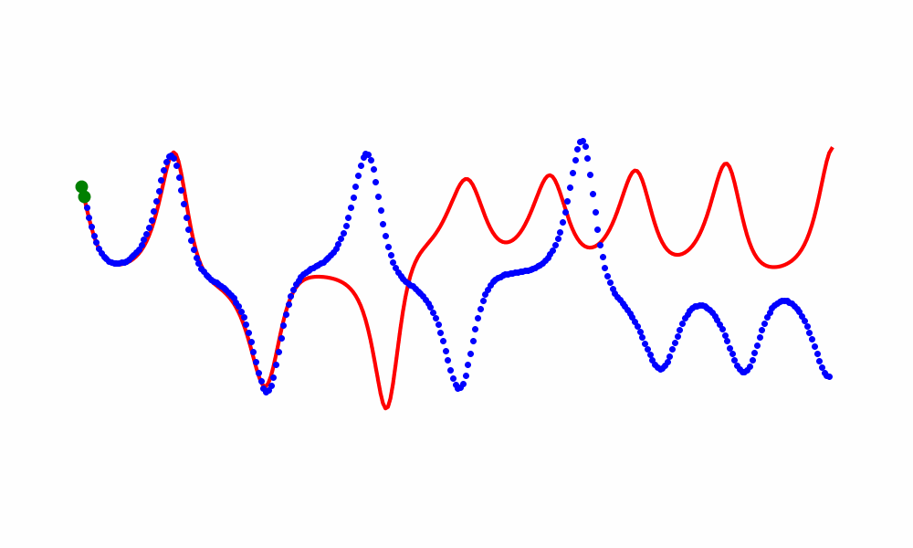


---
# Acknowledgements 

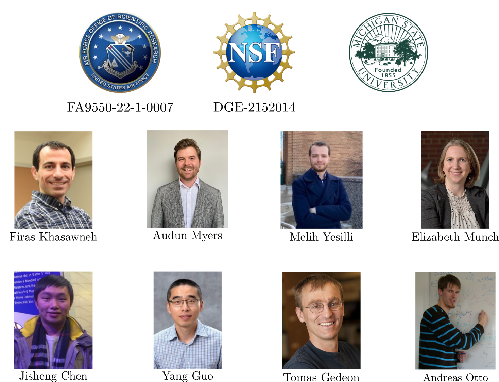

???
I would like to start by thanking the air force office of  scientific research and the national science foundation for funding this work. I would also like to thank my collaborators shown here. 

---
# What I said I would do...

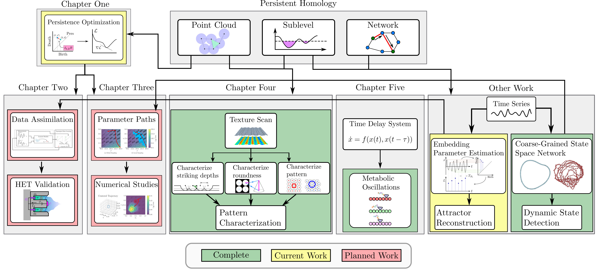

???
Here is an overview of my proposed research plan from my comprehensive exam last year. 

---
count: false
# What I did...
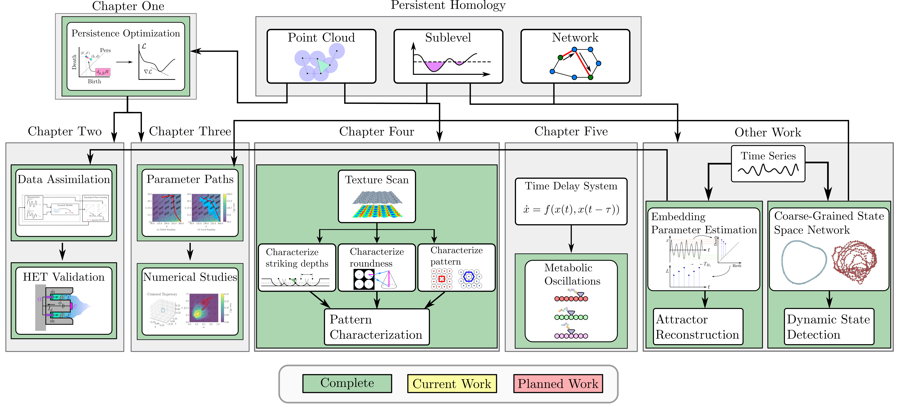

???
Over the last year I was able to complete all of my proposed work. This is the roadmap for my defense. 

I don't have time to discuss all of this work today so I will only be discussing the work I completed after my comprehensive exam. 

I will start with an overview of the tools I use from topological data analysis to build up the background theory and then I will show my work from chapters 2 and 3 on data assimilation and parameter space optimization in dynamical systems using topological data analysis. 

Lets start with an overview of topological data analysis and point cloud persistent homology.

--
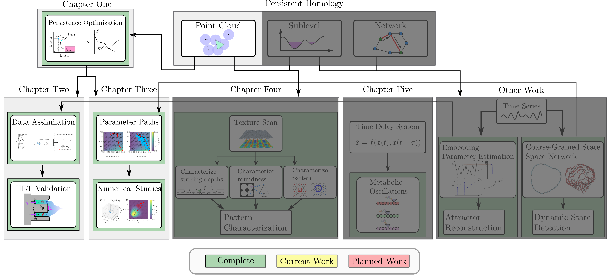
--
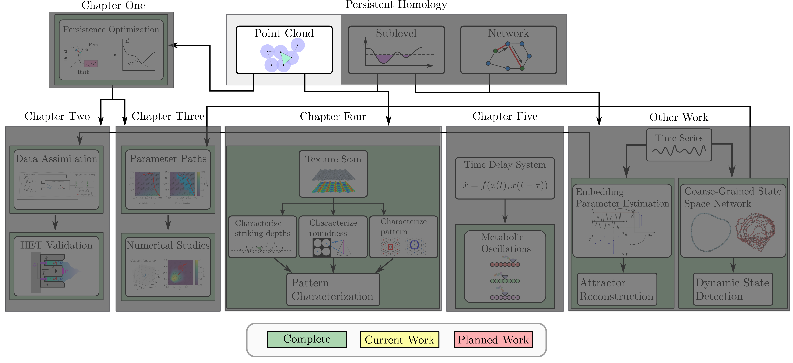


---
# Simplicial Complex and Homology

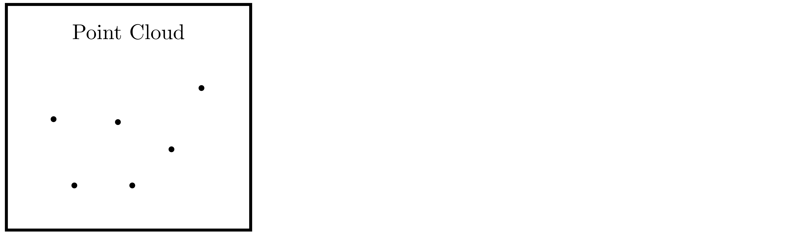

???
Topological data analysis is a field that is focused on extracting shape or global structure information from data. 

Data can come in many forms and one common representation is a point cloud in R^n. The goal is to analyze the shape of this point cloud to draw conclusions about the underlying system that generated the data. To analyze shape we can look at a simplicial complex induced on the point cloud by fixing a connectivity parameter r and adding edges or 1-simplices when the euclidean distance between any two points is less than 2r and adding faces or 2-simplices when this is true for any set of three points. This concept can also be generalized to higher dimensional simplices. Here I have illustrated a simplicial complex called the Vietoris Rips complex but other simplicial complexes also exist that can be used for other applications. 

Once we have a simplicial complex induced on the data, we can say something about its shape by computing its homology. Homology gives a measure of structure in different dimensions. For example, in the figure here there is a 0D homology class as a connected component and a 1D homology class as a loop that has not closed in the simplicial complex. We can also have higher dimensional homology such as 2D which quantifies voids and so on. 

It is difficult to choose the connectivity parameter that will result in optimally extracting topological information from the data. To avoid this choice, we instead study a changing simplicial complex or filtration where each successive complex includes the previous. Quantifying how the homology changes with respect to the connectivity parameter is called persistent homology. 

--
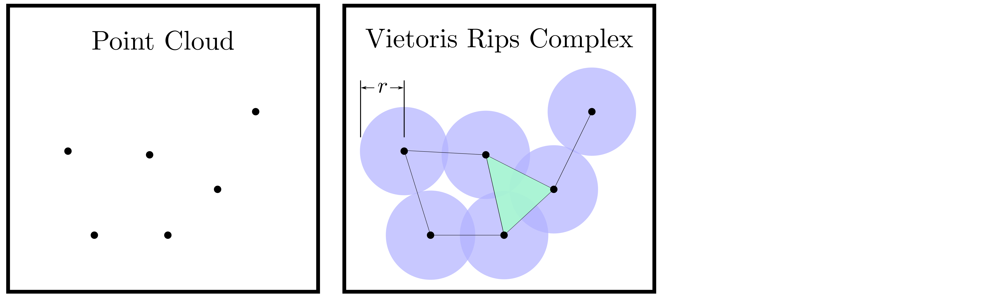
--
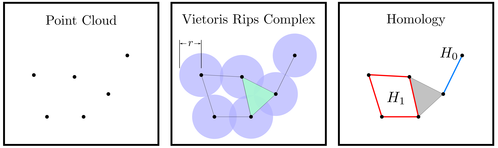

---
# Persistent Homology - Point Cloud

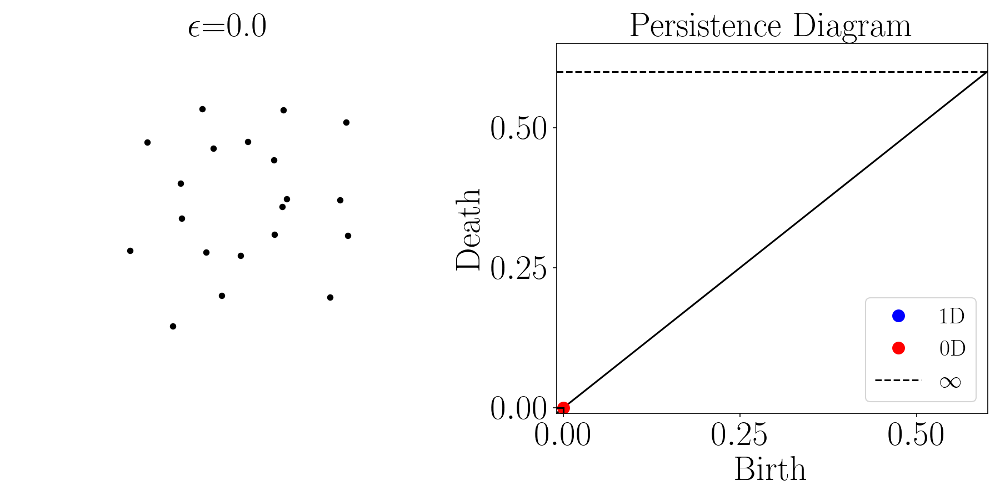


???
Topological data analysis focuses on quantifying shape in data and the specific tool I am interested in is persistent homology which studies a changing simplicial complex called a filtration and tracks the birth and death of homology classes such as connected components or loops in the persistence diagram.

This variation of persistent homology is called point cloud persistence where the simplicial filtration is constructed using the vietoris rips complex. This complex uses the euclidean distance between points to determine when edges or faces are added in the filtration. In other words, we center a ball at each point and grow the radius of the balls or more generally the connectivity parameter of the filtration. When any two balls intersect we add an edge to the complex and when any three intersect we add a face or triangle.  


In this example I constructed the point cloud using two concentric circles with additive noise. All of the connected components are born at an epsilon value of 0 and we will see that the center circle forms a prominent loop in the data that will be reflected in the persistence diagram. 

We see that as the connectivity parameter increases a loop forms in the center and the persistence diagram shows a 1D persistence pair is born at the same epsilon. As epsilon increases the loop eventually fills in and the persistence pair stops moving away from the diagonal indicating that the loop has died or filled in. 

Typically persistence pairs near the diagonal are from features due to noise and pairs far from the diagonal indicate prominent structures in the data.

--
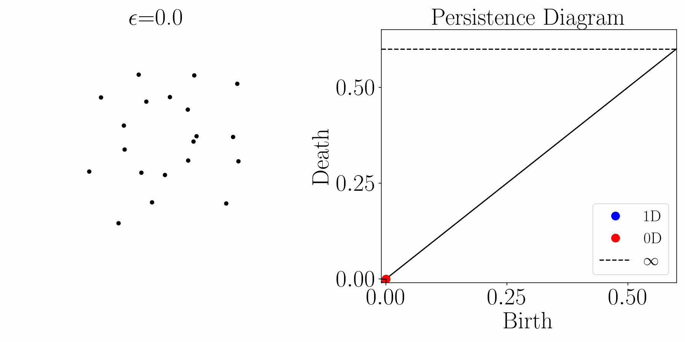

--
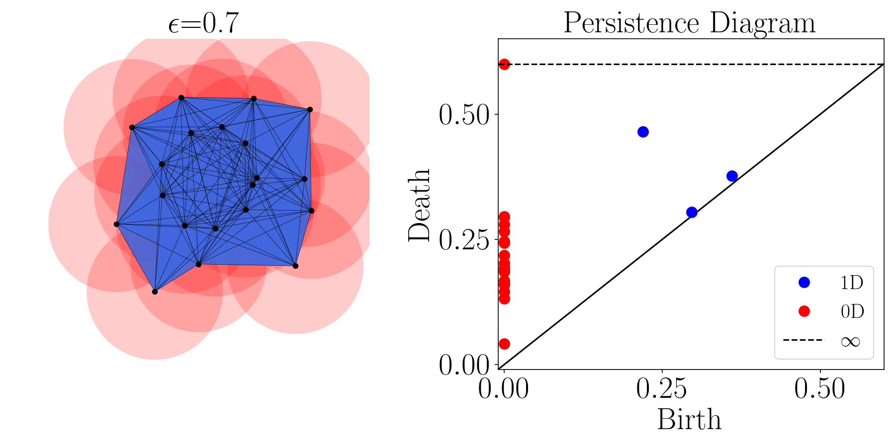


---
# Advantages of Persistence


???
Computing persistent homology has many advantages. It provides a compressive summary of shape for the data by allowing for representing complex structures as a list of few points. 

It has also been proven that persistence is stable under small perturbations, and is robust to noise where structures due to noise show up near the diagonal. Finally, it is conducive to machine learning allowing for topological features of the data to be integrated into an ML pipeline. 

--


.footnote[
     <p style="font-size: 13px;">Cohen-Steiner, et al. "Stability of persistence diagrams." Proceedings of the twenty-first annual symposium on computational geometry. 2005.<br></p>
     ]

--

--


---
# Some Applications of Persistence


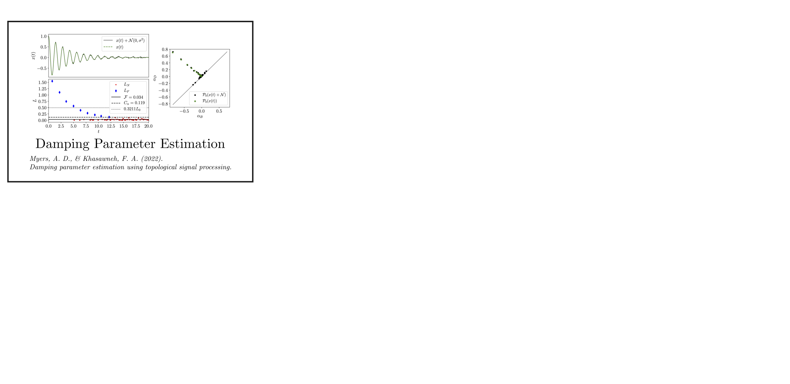

???
Persistence has been successfully applied across many domains such as damping parameter estimation, bifurcation detection, surface texture analysis, chatter detection in machining, quantifying topology of different weather patterns, and stochastic bifurcation detection in dynamical systems. These are only a few of the many other applications of persistence. 

All of this success has been achieved in the absence of a calculus on the space of persistence diagrams. Recently, a framework for differentiation of persistence diagrams has been introduced that unlocks an entirely new class of problems that can be solved using persistence. 

--
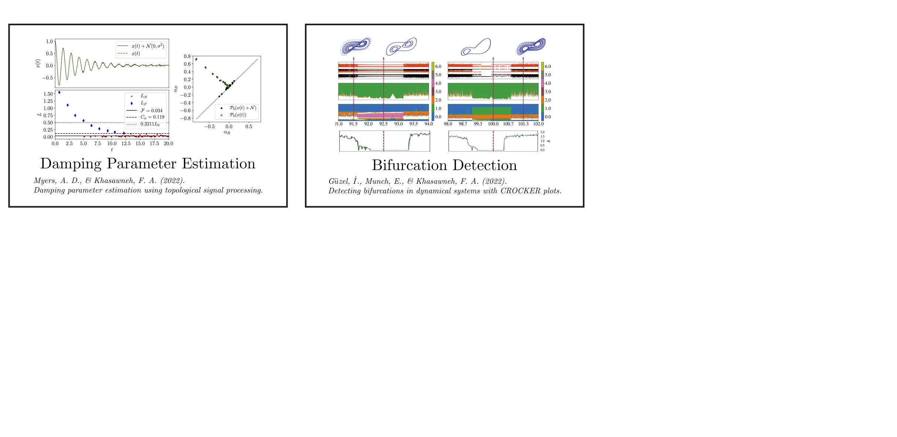
--
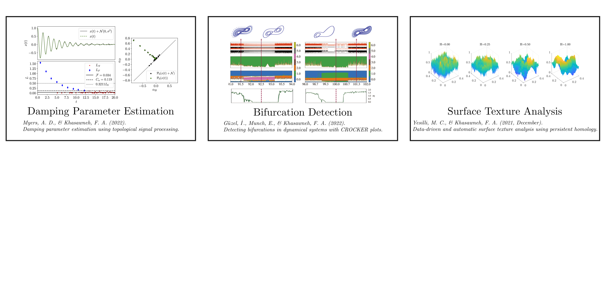
--
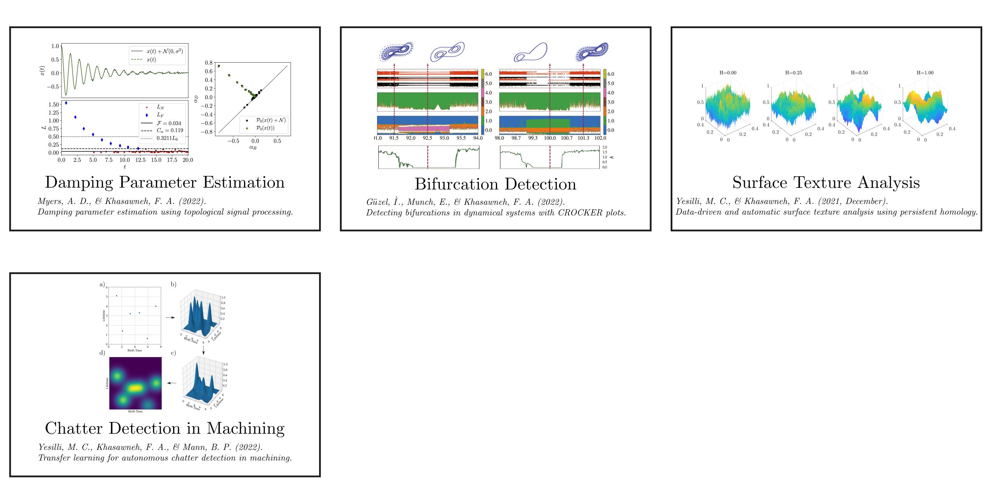
--
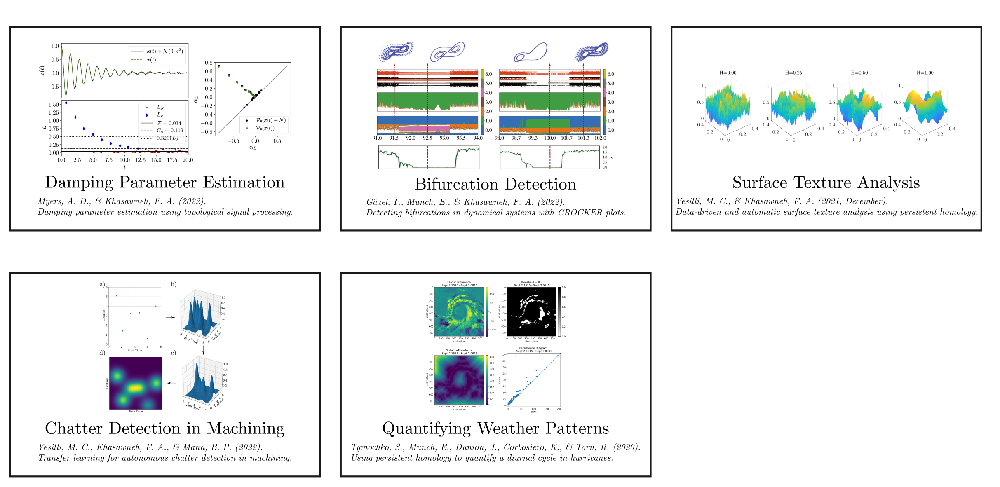
--
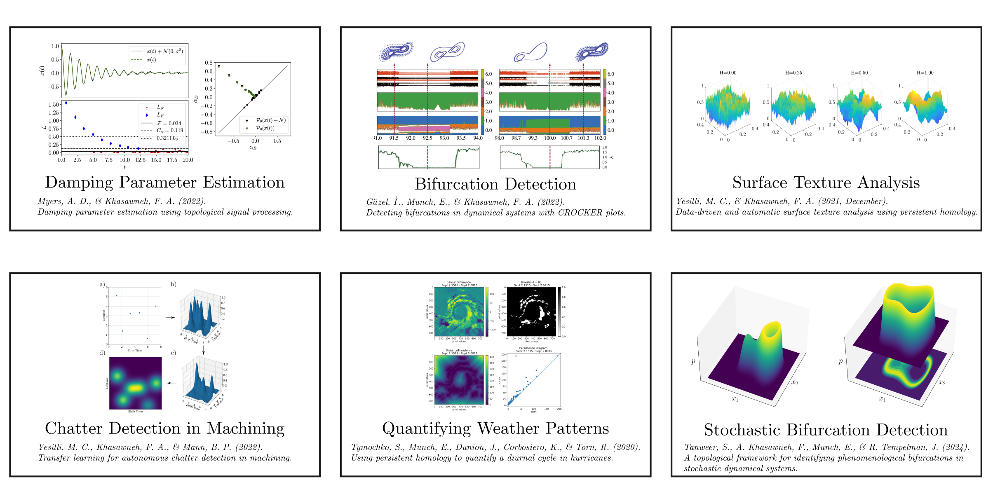


---
count: true
# Differentiability and Optimization

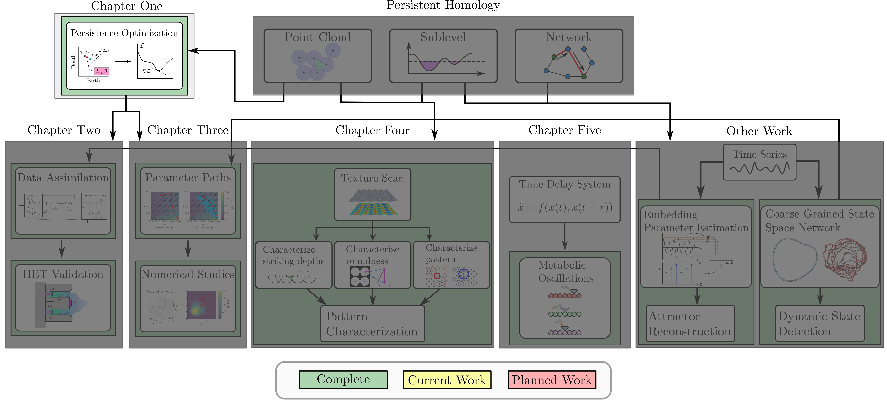

???
This leads into the first chapter of my work where I review the necessary background theory for differentiability of persistence diagrams and optimization using persistence based functions.

---
# Persistence as a Map

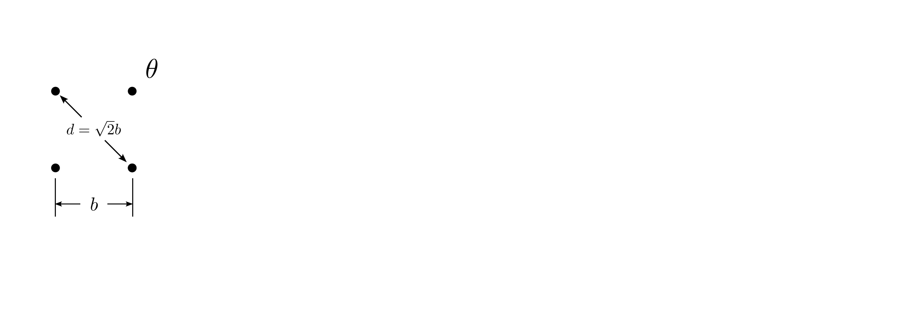

???
To study the idea of differentiability in the space of persistence diagrams it is useful to think of persistence as a map. If I start with a point cloud theta, I can map this point cloud to the persistence diagram using the relevant filter function. For this example I am using the Vietoris Rips filtration.

In this case there is one loop that is born at r=b and dies at r=sqrt(2)b.

The persistence diagram can then be mapped to a real valued feature with the map V. Here I am showing the total persistence feature which quantifies how far points are from the diagonal. 

Together, the maps B and V can be composed to form a map composition from point cloud to persistence feature. 

--
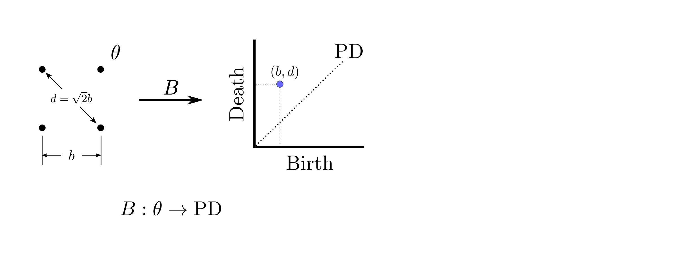

.footnote[Leygonie, Jacob, Steve Oudot, and Ulrike Tillmann. "A framework for differential calculus on persistence barcodes." Foundations of Computational Mathematics (2021): 1-63.]

--
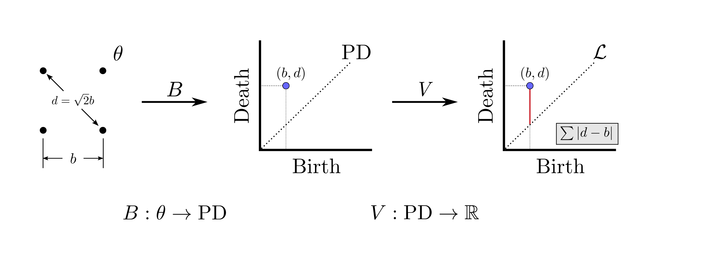
--
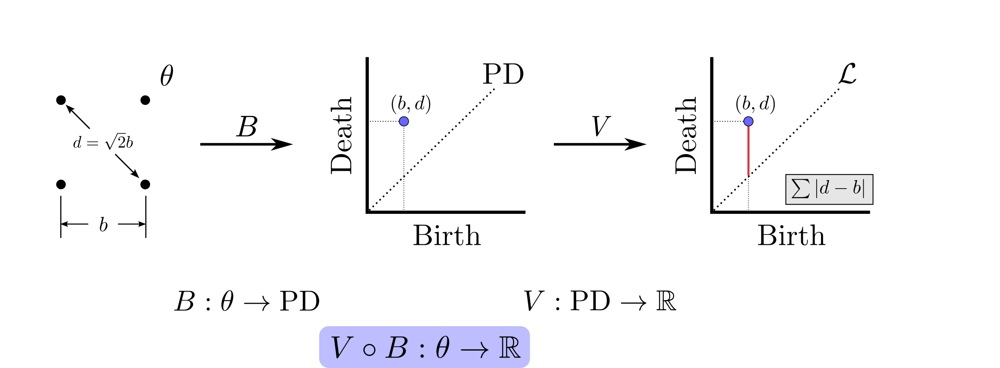

---
# Functions of Persistence

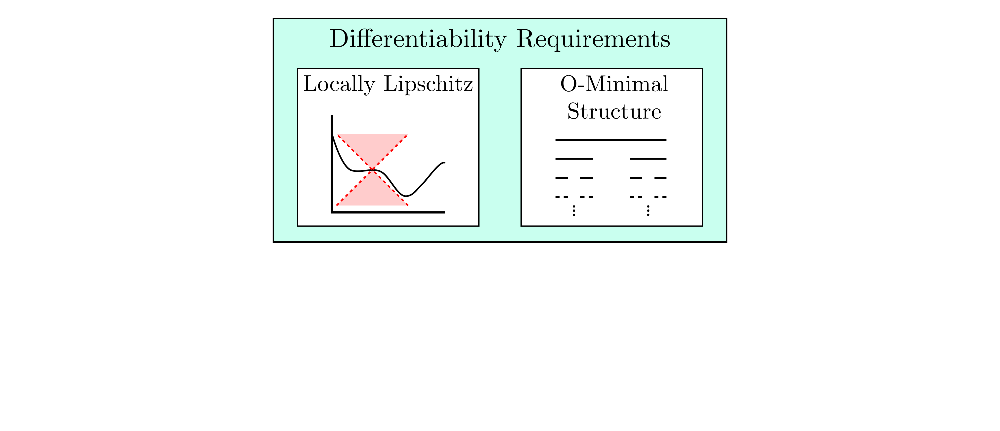

.footnote[Carriere, Mathieu, et al. "Optimizing persistent homology based functions." International conference on machine learning. PMLR, 2021.]

???
There are many different functions of persistence that can be used to quantify and optimize various topological properties of a point cloud. In order to have differentiability in this pipeline, two criteria need to be satisfied. The function needs to be locally lipschitz and it needs to be definable in an o-minimal structure or in other words definable using finitely many unions of points and intervals. Most normal functions meet this criteria so we wont have to worry about it too much but it's something to consider when defining new functions of persistence. 

IF SOMEONE ASKS: An example of a set that fails this criteria is the cantor set because it requires infinitely many  operations to determine if a point is in the set. 

If both of these conditions are satisfied, the derivative of the map composition V of B is definable. I will now show a few useful examples of persistence functions. 

First we have the total persistence or the sum of the lifetimes of all persistence features. Maximizing this function would result in a point cloud with large distances between points in 0D persistence or large loops in 1D persistence. 

The second function of persistence is the maximum persistence which allows for controlling the largest distance between any two points in 0D persistence or the size of the largest loop in the data for 1D persistence. 

There are also methods for quantifying dissimilarity between two persistence diagrams. The wasserstein distance uses an optimal matching between persistence diagrams to to give a notion of distance between them. This can be used to reach a point cloud that gives a target persistence diagram by minimizing the wasserstein distance. 

Lastly, persistent entropy gives a measure of order in the persistence diagram and can be used to control the simplicity of a point cloud and when used in combination with other persistence functions can give a simpler solution to the optimization problem. 

--
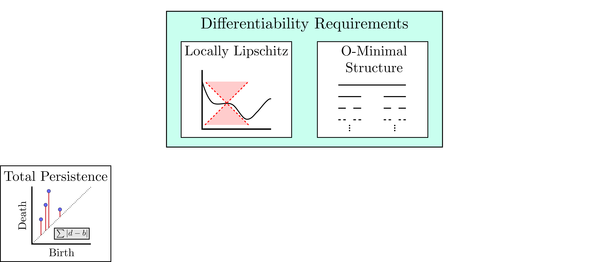
--
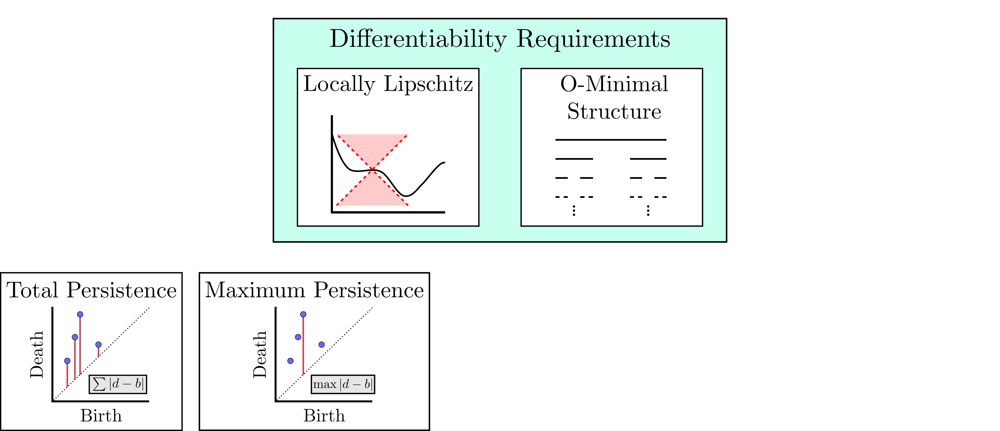
--
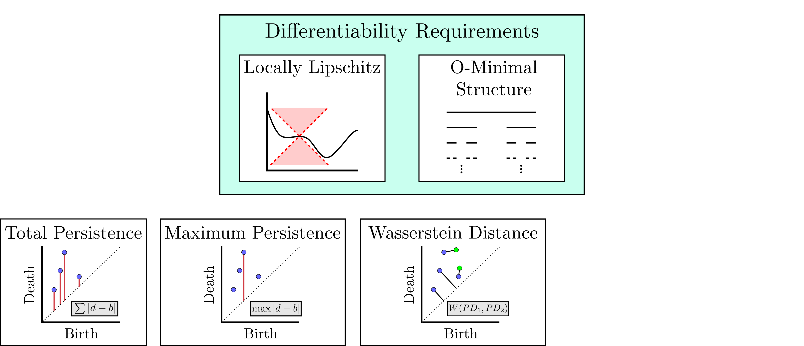
--
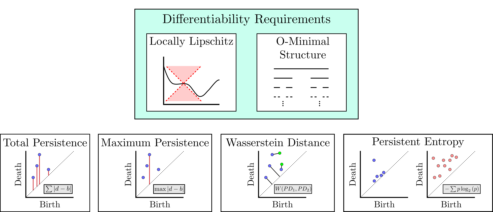


---
# Differentiability of Persistence Diagrams

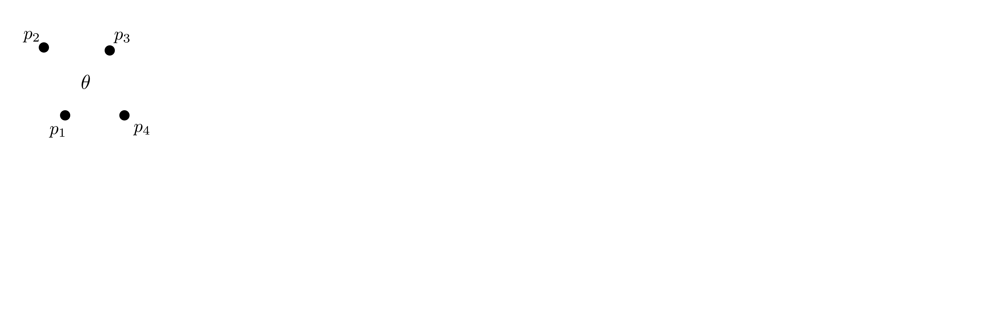

???
Here I will go through the process of how a persistence diagram can be differentiated using the Vietoris Rips filtration. I'll start with a simple point cloud of 4 points called theta. We see that this point cloud has a single loop structure if we only consider 1D persistence for now. When the connectivity parameter reaches the value where the loop is born, we call this simplicial complex sigma. At this point, I label the edge that results in the birth of the loop and its vertices as shown. Likewise, we consider the simplicial complex where the loop dies and label those vertices and corresponding edge. 

Using the map B, we can map theta to a persistence diagram in terms of b and d. This process has been shown previously without labeling the attaching edges in the simplicial complexes. To differentiate this persistence diagram, we consider a perturbation of the point cloud theta called theta prime. In this case I am only perturbing p2 to p2 prime but note that any points can be perturbed. In this case p2 prime is moved along the u hat vector. 

If we go through the same process of labeling the attaching edges of the corresponding loop in the point cloud we can obtain a persistence map B tilde. We see that the attaching edge b prime is now smaller than b and d prime remains equivalent to d. In the persistence diagram this corresponds to the persistence pair moving to the left. 

So the derivative of the persistence map B with respect to the perturbation persistence map B tilde is the unit vector pointing to the left. 

More generally, using the rips filtration the derivative of the persistence map is computed as a set of vectors (one for each persistence pair) with components consisting of inner products of the distances between vertices at the end points of attaching edges and the unit vector perturbations of the points. This can be further generalized to include infinite persistence pairs and for other filter functions, but I will only consider the rips filtration for now. 

--
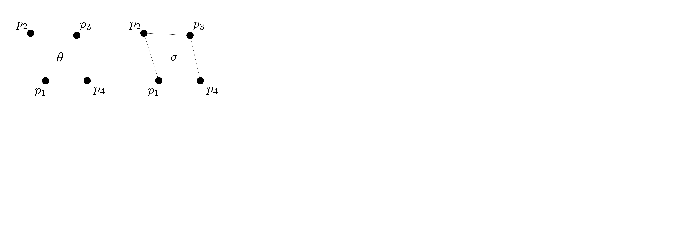
--
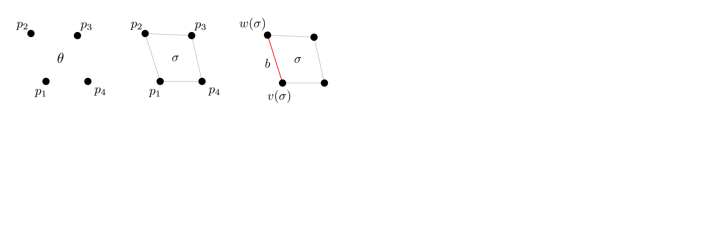
--
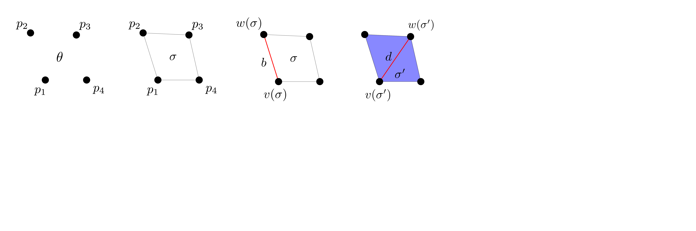
--
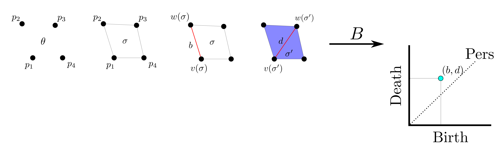
--
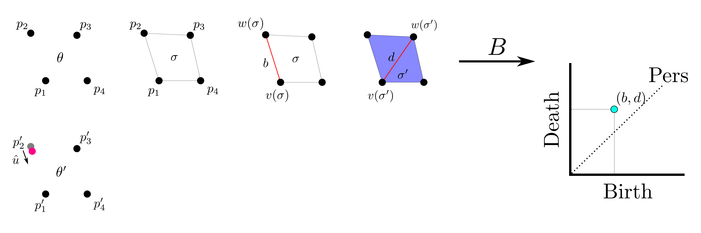
--
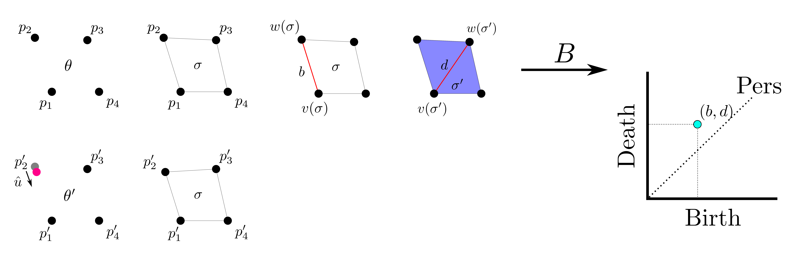
--
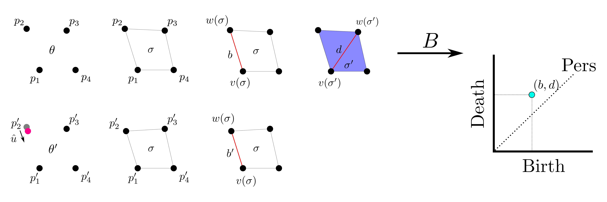
--
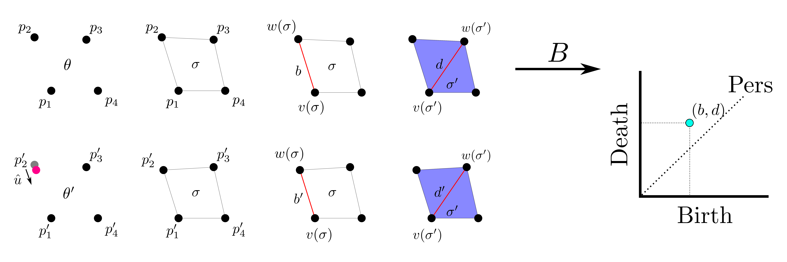
--
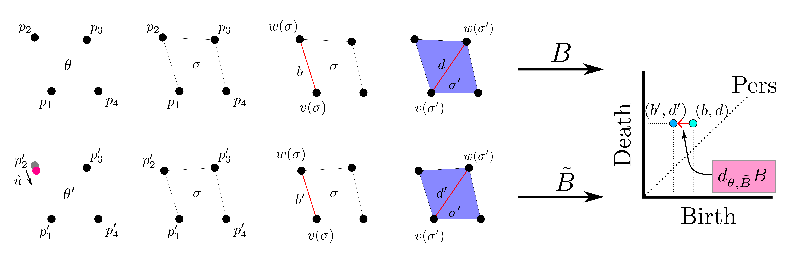
--
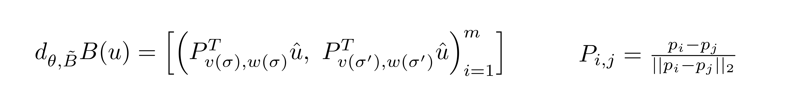

.footnote[Leygonie, Jacob, Steve Oudot, and Ulrike Tillmann. "A framework for differential calculus on persistence barcodes." Foundations of Computational Mathematics (2021): 1-63.]

   

---
# Persistence Optimization

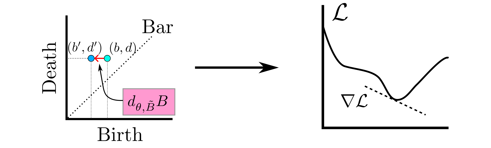

???
Now that I have defined what it means to differentiate a persistence diagram, I can define a cost function to promote desired topological properties of a point cloud by controlling features of the persistence diagram. The ability to differentiate functions of persistence enables gradient descent optimization to reach a point cloud that minimizes the cost function. Tensorflow and the gudhi python library can be used to perform this gradient descent operation on persistence diagrams. 

For the first example I defined a cost function using two terms. The first term is the opposite of the total persistence so by minimizing L we are promoting larger loops in the point cloud and 1D persistence diagram. The second term is a regularization term to promote points remaining within a 2x2 square of space. 

If I start with a circular point cloud with some additive noise, performing the optimization results in a point cloud consisting of a large loop and we see that the persistence pair moves in the vertical direction. Since there is only one persistence pair in this example the maximum persistence could have also been used to achieve the same outcome. 

--
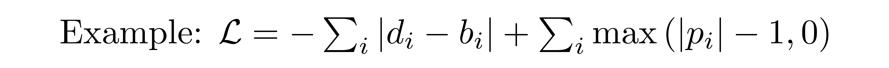
--

--
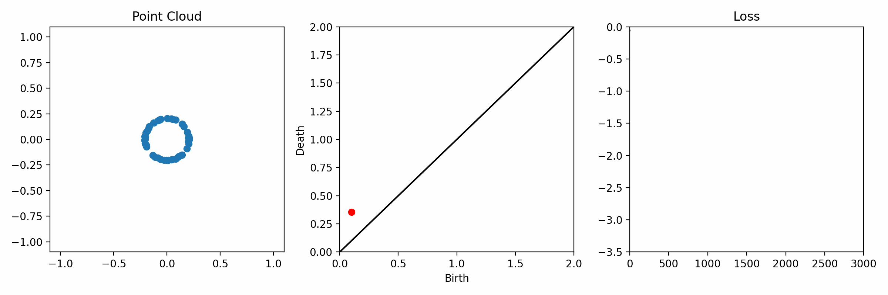

.footnote[Carriere, Mathieu, et al. "Optimizing persistent homology based functions." International conference on machine learning. PMLR, 2021.]


---
count: true
# Data Assimilation using Persistence Optimization

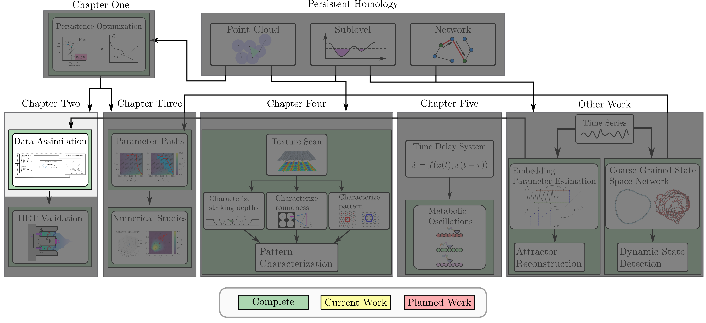

???
Now I will cover my work from chapter 2 of my thesis where I developed a new data assimilation algorithm using persistence optimization.

---
count: true
# Topological Data Assimilation

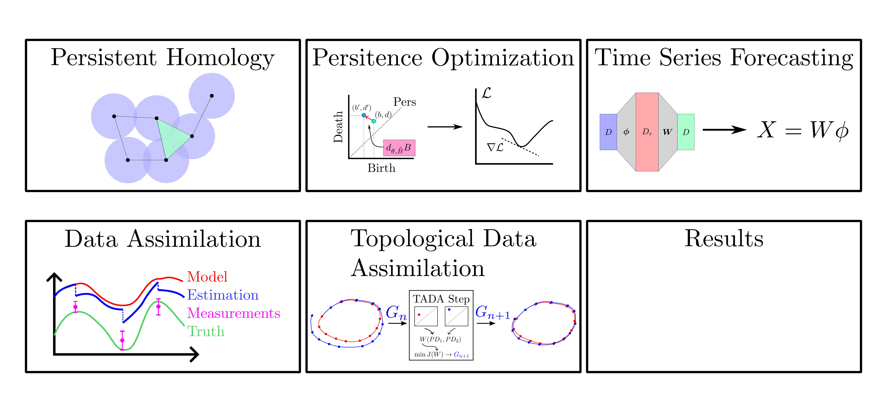


???
Here is the outline for my data assimilation work. We have already covered persistent homology and persistence optimization so now we will discuss time series forecasting to build the necessary background for the algorithm. 

--

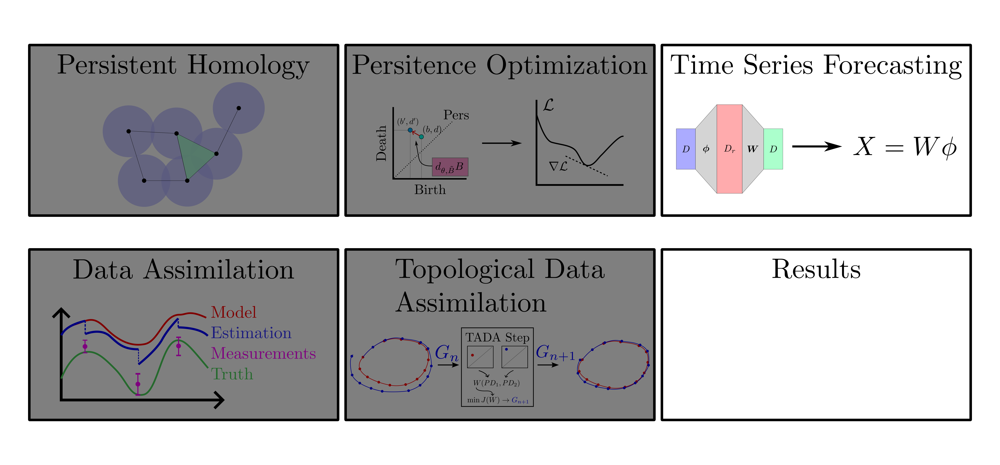


---
# General Time Series Forecasting


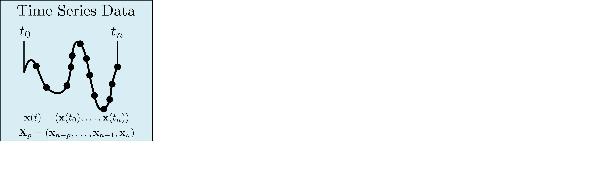

???
In general, with time series forecasting it is assumed that we have data that varies in time and can be multi-dimensional. The goal is to predict future states of the system given past observations. So X_p is defined to be a window of p past observations that we want to use to predict the next point. 

X_p is the input to some general forecast function G but here I represent that as a recurrent neural network for visualization. G depends on X_p and internal weights and biases in the model to predict the next state. mu contains all of the internal parameters for the model that are not varied in training. 

The output of G is the next point in the time series which is then used to shift the points in X_p to continue generating a forecast. 

--
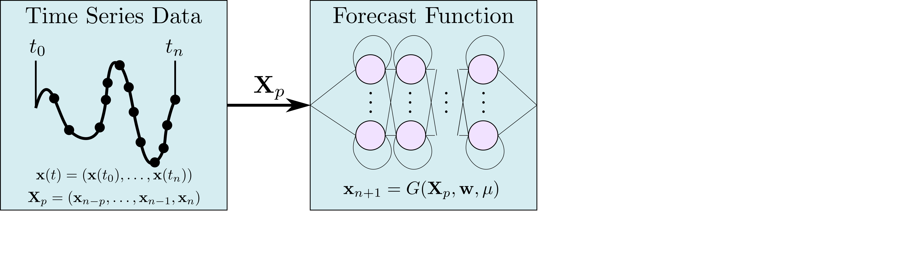
--
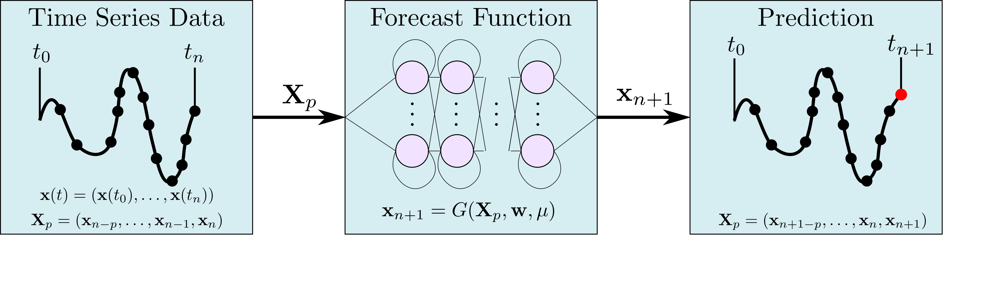
--
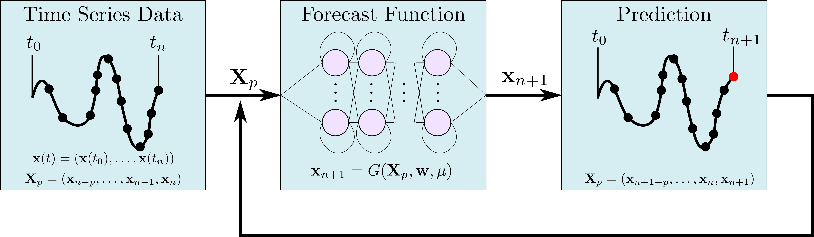


---
# Random Feature Map Forecasting

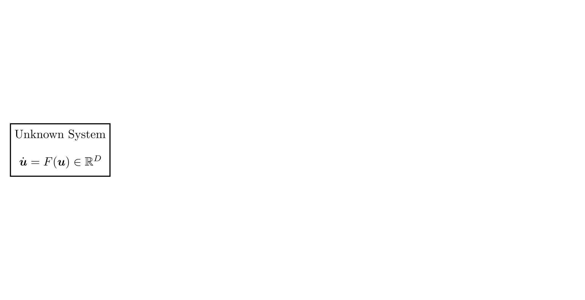

.footnote[Rahimi, A., & Recht, B. (2007). Random features for large-scale kernel machines. Advances in neural information processing systems, 20.]

???
The first forecasting method used in this work is called random feature map forecasting. This method works by assuming we have a D dimensional unknown system.

It is assumed that we are only able to obtain noisy observations of the true underlying system. U^o_n is the observation at the nth step and U_n is the true state. Gamma is the measurement covariance matrix and eta is the noise.

The idea with random feature map forecasting is that we start in a D dimensional space from the measurements and use random feature maps to move to a higher dimensional space with reservoir dimension Dr. It has been shown that high dimensional random features can approximate functions arbitrarily close due to universal approximation. 

The tanh function was used in this work but in general any activation type function that is a function of the weights and bias in this form will work. The weight matrix and bias vector are drawn from uniform distributions and fixed for the training process. 

These feature vectors exist in a Dr dimensional space and the goal is to learn surrogate model coefficients W_LR in this space using linear ridge regression. These model coefficients form a map from the random feature space to the state space of the system and this map is then used to predict future system states. 

The cost function here is defined to minimize the differences between the model and observations with regularization. 


This forecast function can be written in the form in the blue box which fits the general form from the previous slide where only the last point is used to predict the next so p=1 and W_LR contains the weights that are tuned to optimize the forecast. The internal weights and biases here W_in and b_in are contained in mu because they are not updated during training.  


--

--

--

<div style="position: absolute; top: 8%; left: 60%; padding: 0%; background-color: rgba(255, 255, 255, 0.0);">
        <p style="color: red; font-size: 25px;">(Universal Approximation)</p>
</div>
--

--

--

--

--


---
# Long Short-Term Memory Network

- $x_t\to$ Current State(s)
- $c_t\to$ Long-Term Memory
- $h_t\to$ Short-Term Memory
- $\hat{y}\to$ Prediction


.footnote[Géron, Aurélien. Hands-on machine learning with Scikit-Learn, Keras, and TensorFlow: Concepts, tools, and techniques to build intelligent systems. " O'Reilly Media, Inc.", 2022.]

???
Another forecasting method I used in this work is the Long Short-Term memory network or LSTM. 

The LSTM Architecture takes current state x with short and long term memories h and c as input. 

The forget gate f chooses which memories to send from short to long term memory. 

The main layer g is used for making predictions. 

The input gate decides which values from the main layer are stored in long term memory. 

Lastly, the output gate determines which states to return from the memory to predict the next point. 

--
- $f_t\to$ Forget Gate

--
- $g_t\to$ Main Layer

--
- $i_t\to$ Input Gate

--
- $o_t\to$ Output Gate


---
count: false
# Long Short-Term Memory Network

- $x_t\to$ Current State(s)
- $c_t\to$ Long-Term Memory
- $h_t\to$ Short-Term Memory
- $\hat{y}\to$ Prediction

<!--  -->

.footnote[Géron, Aurélien. Hands-on machine learning with Scikit-Learn, Keras, and TensorFlow: Concepts, tools, and techniques to build intelligent systems. " O'Reilly Media, Inc.", 2022.]

???
The LSTM equations can be combined to fit the general forecast function format that I use in this work. The long term memories are updated with this equation, short term memories are then updated with this equation and finally a fully connected hidden layer is used to translate the output of the network into a prediction of the next state. 

Together these three equations fit the general form but it cant be easily written explicitly due to c_n being defined recursively. In this example w contains weights and biases from every layer of the network and this method does not have any internal parameters like random feature maps so mu is empty. 

--
$$c_n =  \sigma(W_{xf}^T \mathbf{X}_p + W_{hf}^T h_{n-1} + b_f) \odot c_{n-1} +\\ \sigma(W_{xi}^T \mathbf{X}_p + W_{hi}^T h_{n-1} + b_i) \odot \tanh(W_{xg}^T \mathbf{X}_p + W_{hg}^T h_{n-1} + b_g)$$

--
$$h_{n} = \sigma(W_{xo}^T \mathbf{X}_p + W_{ho}^T h_{n-1} + b_o) \odot \tanh{(c_n)}$$

--
$$\mathbf{x}_{n+1} = W_d h_n + b_d$$

--
- Fits $\mathbf{x}_{n+1}=G(\mathbf{X}_p, \mathbf{w}, \mu)$

---
count: true
# Data Assimilation


???
Once we have a forecasting model we can use data assimilation to update the model and improve predictions.  


---
# Data Assimilation Overview


???
To optimize the forecast horizon in the presence of measurement noise, a concept called data assimilation is used. With data assimilation it is assumed that there is a model for the system that could be obtained from forecasting, and here is a plot of what the model result may look like. 

If measurements are taken from the system, there are associated uncertainties and these measurements contain useful information for updating the forecast model. The true system state could be the green curve here.

In data assimilation, the forecast results are updated based on the difference between the forecast and the measurement result scaled by a gain matrix K. This gain matrix comes from minimizing a cost function to minimize the model and measurement discrepancies based on the respective covariance matrices. This estimation x_a is typically referred to as the analysis. 

Initially, the model is taken to be the optimal estimation and once a measurement is taken, the model result is updated to be closer to the true system state. As more measurements are taken, the estimation improves and you could imagine that for a high enough sampling rate this would essentially be a continuous curve.

These methods typically require knowledge of the noise statistics which may be unknown and gaussian white noise is often assumed so if your data has a different noise distribution these methods can't be used. 
--

--

--

--

--

--

--

--


---
count: true
# Topological Data Assimilation


???
Now I can show the algorithm I designed for using TDA for data assimilation which was designed to not make any assumptions on the noise distribution in the signal. 


---

---
count: false
# Topological Approach for Data Assimilation

---
count: false

# Topological Approach for Data Assimilation (TADA)

---
count: false 

# Topological Approach for Data Assimilation (TADA)


???
I called this algorithm topological approach for data assimilation or TADA and here is how it works. 

I assume that we have N sensor observations with additive noise with arbitrary noise distribution.

These measurements are then used for generating a forecast model using any forecasting method that fits the form G and here the weights are indexed as they will be updated as new measurements are obtained. 

At the current step, I take a window of points from the measurements and forecast to reduce computation times of persistence. 

I then compute persistence on the measurement window point cloud (0D and 1D) and compute persistence on the forecast window point cloud. 

The dissimilarities between all of the persistence diagrams are then computed using the Wasserstein distance.

Persistence optimization is then used to tune the model weights in such a way that the the sum of the Wasserstein distances is minimized. This effectively minimizes topological differences between the measurements and predictions. 

The updated model is then taken to be the analysis solution and is fed back into the loop to be used for the next assimilation window. The next window is obtained by sliding the windows temporally forward by one point with the next measurement.

In the end an optimized model is obtained w_hat that extends the forecast time of the original model using information from incoming measurements. 

I also want to note here that just using the Wasserstein distances between the measurement and model persistence diagrams is not enough for this to work because the temporal information is not accounted for in the state space window point clouds. 

To account for this I compute the errors between the model and measurement point clouds giving me a new point cloud of errors and the persistence diagrams of this point cloud are obtained and the Wasserstein distance is used to minimize the differences between the error persistence diagrams and the empty diagram minimizing temporal shifting between points. 

I also added a second term to the cost function J_2 that performs the same operations but using randomly sampled points from the training data to further constrain the model so it is less likely to jump to a different minima in the cost function. 

--

--

--

--

--

--

--


<div style="position: absolute; top: 80%; left: 5%; padding: 0%; background-color: rgba(255, 255, 255, 0.0);">
        <p style="font-size: 25px;">$$J=J_1+J_2$$</p>
        <p style="font-size: 25px;">$$J_{i} = W_k + \hat{W}_k$$</p>
        <p style="font-size: 25px;">$$k=0,1$$</p>
</div>

<div style="position: absolute; top: 80%; left: 25%; padding: 0%; background-color: rgba(255, 255, 255, 0.0);">
        <p style="font-size: 25px;">$$k=0,1$$</p>
</div>


---
count: true
# Topological Approach for Data Assimilation


???
Now I will show some results from this algorithm by applying it to the chaotic lorenz system using the random feature map forecast function. 

---
# TADA Example (Lorenz)


???
Here I am showing a temporal and state space animation of this algorithm on the Lorenz system. You can see in the beginning the model deviates from the measurements but as the window slides across the signals the model is optimized to give more accurate predictions. 

There are a few hyperparameters that need to be tuned for this method to work. 

---
# Learning Rate Dependence 


<div style="position: absolute; top: 80%; left: 38%; padding: 0%; background-color: rgba(255, 255, 255, 0.0);">
        <p style="font-size: 20px;">$$\mathcal{E}(t_n)=\frac{||\boldsymbol{u}_{\text{valid}}(t_n)-\boldsymbol{u}_n(t_n)||^2}{||\boldsymbol{u}_{\text{valid}}(t_n)||^2} \leq \theta$$</p>
</div>

<div style="position: absolute; top: 80%; left: 10%; padding: 0%; background-color: rgba(255, 255, 255, 0.0);">
        <p style="font-size: 20px;">$$J=J_1$$</p>
</div>

<div style="position: absolute; top: 85%; left: 10%; padding: 0%; background-color: rgba(255, 255, 255, 0.0);">
        <p style="font-size: 20px;">$$\tau_f=\lambda_{max}t$$</p>
</div>


???
First we need to set a learning rate and decay rate as the window slides across the data. 

We measure the forecast accuracy of the model by computing the relative forecast error between them and take the forecast time to be the time where is error reaches 5 percent. We use the maximum Lyapunov exponent for the Lorenz system to convert the number of forecast time points to Lyapunov times to allow this result to be compared to other methods. 

I plotted the average and standard deviation forecast times of the optimized models for the lorenz system using 100 incoming measurements with respect to different learning rates and decay rates at 50 randomly chosen initial conditions. 

In this first result I only used the J_1 cost function term so without sampling points from the training set. We see that the forecast time is maximized for learning rates near 1e-5 and decay rates near 1 but overall the region of parameters that result in increased forecast times is relatively limited. 

If I add the J_2 cost function term to constrain the optimization further, we see the region of feasible learning rates and decay rates is much larger. For the remaining results I use the full cost function with a learning rate decay rate of 0.99.

--


--


---
count: false
# Learning Rate Dependence 


<div style="position: absolute; top: 80%; left: 38%; padding: 0%; background-color: rgba(255, 255, 255, 0.0);">
        <p style="font-size: 20px;">$$\mathcal{E}(t_n)=\frac{||\boldsymbol{u}_{\text{valid}}(t_n)-\boldsymbol{u}_n(t_n)||^2}{||\boldsymbol{u}_{\text{valid}}(t_n)||^2} \leq \theta$$</p>
</div>

<div style="position: absolute; top: 80%; left: 10%; padding: 0%; background-color: rgba(255, 255, 255, 0.0);">
        <p style="font-size: 20px;">$$J=J_1+J_2$$</p>
</div>

<div style="position: absolute; top: 85%; left: 10%; padding: 0%; background-color: rgba(255, 255, 255, 0.0);">
        <p style="font-size: 20px;">$$\tau_f=\lambda_{max}t$$</p>
</div>

---
count: true

# Learning Rate Dependence


???
Next, varied the learning rate to compare the TADA forecast time to the random feature map linear regression method labeled here as LR. Each point in this figure was generated using 500 different initial conditions for the system. 

The solid horizontal green line is the amount of incoming data that was used to optimize the TADA model. We see that the TADA model improves the forecast times over the random feature map method by about 1.5 Lyapunov times. Note that these results were generated without adding noise to the signals. 

---
# Window Size Dependence


???
Another hyperparameter of this method is the sliding window size. I generated results with respect to different window sizes where the window grows to the specified window size as measurements stream in and once it reaches that size the window slides. 

We see that the TADA forecast time is essentially independent of the window size so we chose to use a window size of 50 points for all results presented. 

---
# Noise Robustness


<div style="position: absolute; top: 90%; left: 7%; padding: 0%; background-color: rgba(255, 255, 255, 0.0);">
        <p style="font-size: 25px;">$$\text{White}~(1/f^0)$$ </p>
</div>
<div style="position: absolute; top: 5%; left: 50%; padding: 0%; background-color: rgba(255, 255, 255, 0.0);">
        <p style="color: red; font-size: 25px;">$$\text{SNR}_{dB} = 20 \log_{10}(A_{\rm signal}/A_{\rm noise})$$</p>
</div>
<div style="position: absolute; top: 9%; left: 1%; padding: 0%; background-color: rgba(255, 255, 255, 0.0);">
        <p style="font-size: 25px;">$$10^{-6}\longrightarrow $$ </p>
</div>
--


<div style="position: absolute; top: 48%; left: 1%; padding: 0%; background-color: rgba(255, 255, 255, 0.0);">
        <p style="font-size: 25px;">$$10^{-5}\longrightarrow $$ </p>
</div>


???
Lastly, I tested the noise robustness of this algorithm at the two learning rates that resulted in the largest forecast times. The TADA algorithm was specifically designed to make no assumptions on the noise distribution or statistics of the signals. To test this claim I plotted the TADA and LR forecast times with respect to the signal to noise ratio for different noise distributions. 

The first plot here shows the results for Guassian white noise which gives a forecast time over the green line down to about 33 dB with a learning rate of 10^-6 but when a higher learning rate is used the method is much more robust to noise down to about 28 dB but the forecast times are slightly lower for noise free signals. 

Next I tested the algorithm using a pink noise distribution where the power spectral density decreases linearly with frequency. Interestingly TADA is more robust to this distribution down to about 28 dB for a learning rate of 10^-6 and even better with 10^-5 down to about 23 dB.

Finally, I tested with respect to a Brownian noise distribution where the power spectral density decreases quadratically with frequency. The results are similar to the pink noise case. 

I am not sure why these more complicated noise distributions perform better with this algorithm compared to white noise but similar results were observed with using persistent homology for chaos detection methods in the literature. This is an avenue for future research. 

--


<div style="position: absolute; top: 90%; left: 41%; padding: 0%; background-color: rgba(255, 255, 255, 0.0);">
        <p style="font-size: 25px;">$$\text{Pink}~(1/f^1)$$</p>
</div>

--


--


<div style="position: absolute; top: 90%; left: 73%; padding: 0%; background-color: rgba(255, 255, 255, 0.0);">
        <p style="font-size: 25px;">$$\text{Brown}~(1/f^2)$$</p>
</div>
--


<!-- --

<div style="position: absolute; top: 85%; left: 5%; padding: 0%; background-color: rgba(255, 255, 255, 0.0);">
        <p style="font-size: 20px;">Tempelman, J. R., Myers, A., Scruggs, J. T., & Khasawneh, F. A. (2020, August). Effects of correlated noise on the performance of persistence based dynamic state detection methods.</p>
</div> -->


---
count: true
# Hall Effect Thruster Data Assimilation using TADA


???
Next I will show another application of TADA using Hall Effect Thruster data from the air force research laboratory. 

---
# Hall Effect Thrusters


???

Hall effect thrusters are a class of ion thrusters that generate thrust for a space craft by accelerating ions through an electromagnetic field. 

The diagram on the left shows a side view of the thruster with some solar panels for reference. The thruster contains an anode and cathode labeled here by a and c. The anode and cathode are connected in a circuit with a discharge voltage Vd that results in a discharge current Id. 

An axial electric field is induced using an outer coil of wire and a corresponding radial magnetic field is also induced. Ionized gas (typically xenon) is injected into the thruster which is accelerated through the electric field to generate thrust. 

These thrusters can exhibit some undesirable dynamics such as high amplitude low frequency breathing mode oscillations in the thrust leading to suboptimal performance. 

Another undesirable behavior occurs when some of the high energy ionized particles cause erosion of critical surfaces on the thruster and the space craft. 


It is critical to be able to predict future behavior of these systems to avoid these undesirable behaviors so this is a good application for data assimilation.


Last summer I completed an internship at Edwards Air Force base in California where I studied reduced order data driven modeling for HETs and after my internship the AFRL declassified some high fidelity simulation data for HETs that I could analyze using TADA.   

--

--

--

--

--

--

--


---
# HET Data from AFRL


.footnote[J. M. Fife, Hybrid-PIC modeling and electrostatic probe survey of Hall thrusters. PhD thesis, Massachusetts Institute of Technology, 1998.]

???
The data from AFRL was generated using a software package called HPHall which uses a
hybrid Particle In Cell (PIC) method to model particles on different scales in the system and the Direct Simulation Monte Carlo (DSMC) method for simulating particle collisions. Due to the methods used for simulation, the data is contaminated with noise and I assume the noise distribution is unknown for applying TADA.

The data consists of field data in the thruster plume. If we consider the side view of the thruster, I overlay the spatial points where the system is simulated. Due to symmetry we only need to consider planar data. The region is further reduced due to the upper half by symmetry again. These spatial locations give the state of the system at one moment in time. These points are used to generate a contour plot and then the results are animated in time. 

Here I am showing one variable I used for this analysis which is the electron temperature. The other variable I analyzed in the paper is the electric potential but for this talk I am only showing electron temperature due to time limitations. 


--

--

--

--

--

--


---
count: false
# HET Data Matrices


???
The nonuniform grid spatial data is then unrolled into a data matrix where each column contained 1250 spatial points at one moment in time. 


---
# Electron Temperature Results


???
Now I will show TADA results for the electron temperature using an LSTM forecast function. Here is a plot of the initial squared forecast error. Certain points have a low error but there are significant deviations in the forecast that need to be reduced. 

Here is an animation of the forecast error as TADA is applied to the data. We see that the forecast error decreases drastically as TADA updates the model weights. We can also view this process for specific spatial locations to show the model converging on more accurate predictions.   

window size: 200

learning rate: 1E-5

decay rate: 1%

p=5

J1 sample size: 50

5 LSTM epochs


--

--


--

--


---
class: inverse

# Related Publications
<br>

- **Chumley, M. M.**, & Khasawneh, F. A. (2024). Topological Approach for Data Assimilation. arXiv preprint arXiv:2411.18627.

<br>

- **Chumley, M. M.**, & Khasawneh, F. A. (2025). Hall Effect Thruster Forecasting using Topological Approach for Data Assimilation.

???
Here are my relevant publications for this chapter. The original TADA paper introduces the algorithm with examples using the lorenz 63 and 6 dimensional lorenz 96 system to show improvements in the forecast times using random feature map forecasting. 

The second paper introduces generalizations to TADA to other forecast functions and applies it to HET data with the LSTM forecast function. 

The first paper is on the arXiv already and the second one is ready to go we are just waiting on a green light from our collaborators. 


---
count: true
# Optimal Parameter Paths


???
Now I will move into chapter 3 of my thesis where I use persistence optimization to navigate parameter spaces of dynamical systems. 

---
# Parameter Path Pipeline


???
The goal with this work was to start at some point in a dynamical system parameter space. 

Here I show 3 parameters a, b and c a point can be chosen in this space which corresponds to a specific point cloud in the state space from simulating the system. For this example the system is two dimensional but in general it can be m dimensional. 

Computing 1D persistence on this point cloud leads to a single 1D persistence pair at b,d. The persistence diagram is then mapped to a loss function or function of persistence such as maximum persistence. In this case we will say we want to minimize this feature to reduce oscillation amplitude. 

In order to compute the gradient of the loss function in this case, we need the gradient of the map that takes the parameter space to the point cloud. There are infinitely many directions that can be chosen in the parameter space but the goal is to move in a direction that minimizes the loss function. 

Computing the derivative of B' allows for taking a step in the loss function space. This will lead to a new persistence diagram, a new point cloud, and consequently a new point in the parameter space. In general the parameter space can be n dimensional. 

My goal was to study this map B' and compute its derivative numerically to perform this parameter space navigation using persistence based cost functions to promote specified dynamical system behaviors. 

--

--

--

--

--

--

--

--

--

--


---
# Differentiability of B' (Adjoint Sensitivity Method)


.footnote[Chen, Ricky TQ, et al. "Neural ordinary differential equations." Advances in neural information processing systems 31 (2018).]

???
The operator B' is essentially an ODE solver. ODE solvers have been differentiated for use with neural ODEs where instead of having a regular neural network with discrete layers, there is a continuum of layers that are described using an ODE. For this work I just needed to be able to differentiate the ODE solver which uses a method called the adjoint sensitivity method. This is built in to the pytorch neural ODE software torchdiffeq. 

It works by starting with an ODE system that depends on parameters mu. An ODE solver is used to obtain the time evolution from an initial state.

If I define some arbitrary loss function that depends on the state space data, we can compute the gradient of the loss with respect to the system states by defining an adjoint state a(t). In the paper at the bottom, the authors show that a(t) can be obtained by solving another ODE which is a continuous analogue of the chain rule. Solving for a(t) backward in time gives a discontinuous solution at each point and the change in the adjoint state gives the gradient vector for each state.  

So taking a step in the loss function space would then update the state space of the system. In this example the loss function depended on the system states but it can also be differentiated with respect to system parameters mu by computing this integral after solving for a(t) from the paper cited at the bottom. 

Using this method, the derivative of B' can be computed giving an optimal direction to vary the system parameters to minimize the loss function that depends on system states. 

--

--

--

--

--

--

--

--

--

--

--


---
# Gradient Challenges


???
I ran into a number of significant challenges with this method. We can see from the equations, if the system states change drastically with changes in the loss function, it will result in very large adjoint states or exploding gradients. This occurs when the system response is chaotic.

To overcome exploding gradient issues the standard practice is to use gradient clipping so I clip the gradient norms to be 1 in my results. 

The second issue I ran into is that when using multiple loss terms the scaling was unbalanced so to balance the loss functions I divided each term by its current value. 

The last thing I did was apply learning rate decay to ensure that the path converges eventually. However, if no decay is applied this can be used to optimally explore the parameter space. 


--

--

--


.footnote[B. Xiao, “Strategies for balancing multiple loss functions in deep learning.” Medium, 2024.]

--


---
# Cost Function library


???
To perform this optimization, I needed to define a cost function library using persistence functions to map the terms to dynamical system behaviors. 

The first term was designed to promote or deter large loops or oscillations in the system. If the goal is to move 1D persistence pairs away from the diagonal this corresponds to increasing the loop sizes in the state space. Mathematically, the maximum persistence can be used here and maximizing this function results in the largest possible loops.

The next term was defined to promote fixed points in the system by pushing all persistence pairs toward the diagonal. In the state space this corresponds to constricting the points to a small region or single point. The total persistence is minimized in this case.   

I designed the third term to deter chaos in the system which corresponds to persistence diagrams with high entropy. In this state space this corresponds to constricting points to a uniform loop and mathematically the persistent entropy is used. In general it is difficult to distinguish between chaos and noise in the persistence diagram so this term should be used with caution. 

The last term I defined was based on avoiding regions of the parameter space due to physical limitations. This can also be used to forbid certain persistence behaviors too which I show examples of in my thesis. 

--

--

--

--

--

--

--

--

--

--


---
# Numerical validation


???
Now I will show numerical examples of this process to demonstrate its capabilities.


---
# Numerical Examples


???
In my thesis I show many examples of different scenarios where I promote specified behaviors using persistence cost functions on different dynamical systems. I give examples using the Rossler system, the magnetic based excited pendulum system and the lorenz system. 

For this talk however I focus on the Rossler system due to time constraints and because it gives the most insight to the usage of this method.  


--


.footnote[Myers, A., & Khasawneh, F. A. (2020, August). Dynamic State Analysis of a Driven Magnetic Pendulum Using Ordinal Partition Networks and Topological Data Analysis. In International Design Engineering Technical Conferences and Computers and Information in Engineering Conference (Vol. 83969, p. V007T07A021). American Society of Mechanical Engineers.]

--


--


---
# Rössler System


???
The rossler system is defined with these equations and has 3 parameters a, b and c.

I fixed c to be 5.7 for all results and plotted persistence features with respect to a and b. Here is the plot of the maximum persistence. We see that for larger a values the system is chaotic and as a decreases the response becomes periodic and then approaches a fixed point. 

I also plotted the total persistence which mostly has the same shape and the persistent entropy. We see that in the fixed point region the persistent entropy is actually at its maximum value. I discovered that due to the persistence pairs having such small lifetimes the entropy is still high even when it is normalized. This shows that when the desired behavior is fixed point stability the persistent entropy should not be used. 

Here are the simulation parameters I used for these examples. The vary the learning rate and decay rates so if those change I will point it out. 

Note that the simulation times need to be carefully chosen so the system is in a steady state but if the simulation is too long the computation times become unreasonable. 


--

--

--

--


---
# Rössler Example 1 (Chaos $\to$ Periodic, 0.1% Decay)


???
For the first example, the goal was to start in the chaotic region and move to a periodic solution. I decreased the decay rate in this case to 0.1% and used a loss function defined as the entropy minus the maximum persistence to promote large loops.

Here is an animation of this optimization. Due to the small decay rate the path explores the periodic region and eventually settles down on a periodic solution after many steps. 

In my thesis I show what happens if the decay rate is too large the optimizer is never able to exit the chaotic region because it doesn't have enough momentum. 

--

--


---
# Rössler Example 2 (Periodic $\to$ Fixed Point 5% Decay)


???
For the second example I generated a path to move from a periodic solution to a fixed point using the maximum persistence which in this case is the same as total persistence. I discovered that using maximum persistence here worked better than total persistence because as the path enters the fixed point regions low lifetime persistence pairs show up that actually increase the total persistence which can lead to the path not entering the fixed point region. 

Here I am using a larger decay rate to reduce exploration and give a path that converges faster.  


--

--


---
# Rössler Example 3 (Chaos $\to$ Fixed Point, 0.02, 0.1%)


???
In the last example, I aimed to move from the chaotic region to a fixed point using the total persistence. The total persistence is actually maximized in the periodic region so in this case I had to increase the learning rate to 0.02 to get it to overcome the bump in the middle. 

Here is the animation of this example. We see the path quickly exits the chaotic region and moves over the periodic region to eventually settle down in the fixed point. Due to the regularization I applied the path bounces off of the wall at a=-0.1. 


--

--


---
class: inverse

# Related Publications
<br>

- **Chumley, M. M.**, & Khasawneh, F. A. (2025). Optimal Navigation of Constrained Dynamical System Parameter Spaces using Persistent Homology


???
Here is the paper for this chapter. I will be posting this to the arXiv soon I am just finishing up the literature review. 

---
# Other Projects


???
My thesis also contains other work that I completed prior to my comprehensive exam in chapters 4 and 5 and I have other work focusing on state identification in time series data as well that is not part of my thesis. 

---
class: inverse

# Related Publications


<p style="font-size: 20px;"><b><u>Chapter 4 (Texture Analysis)</u></b></p>
<p style="font-size: 15px;">- <b>Chumley, M.M.</b>, Yesilli, M.C., Chen, J, Khasawneh, F. A., & Guo, Y., <b>"Pattern characterization using topological data analysis: Application to piezo vibration striking treatment"</b>, Precision Engineering, Volume 83, 2023. <i>[Editor's Recommendation]</i></p>
<p style="font-size: 15px;">- Yesilli, M.C., <b>Chumley, M.M.</b>, Chen, J, Khasawneh, FA, & Guo, Y. <b>"Exploring Surface Texture Quantification in
Piezo Vibration Striking Treatment (PVST) Using Topological Measures.”</b> Proceedings of the ASME 2022 17th
International Manufacturing Science and Engineering Conference.</p>

<p style="font-size: 20px;"><b><u>Chapter 5 (Modeling)</u></b></p>

<p style="font-size: 15px;">- <b>Chumley, M.M.</b>, Khasawneh, F.A., Otto, A. et al. <b>"A Nonlinear Delay Model for Metabolic Oscillations in Yeast Cells"</b>. Bull Math Biol 85, 122 (2023). https://doi.org/10.1007/s11538-023-01227-3</p>

<p style="font-size: 20px;"><b><u>Other Publications</u></b></p>
<p style="font-size: 15px;">- Khasawneh, F. A., Munch, E., Barnes, D., <b>Chumley, M. M.</b>, Güzel, İ., Myers, A. D., ... & Yesilli, M. (2025). <b>Teaspoon: A Python Package for Topological Signal Processing.</b> Journal of Open Source Software, 10(107), 7243.</p>
<p style="font-size: 15px;">- Myers, A. D., <b>Chumley, M. M.</b>,& Khasawneh, F. A. (2019). <b>"Delay parameter selection in permutation entropy using topological data analysis."</b> La Matematica, 3(3), 1103-1136.</p>
<p style="font-size: 15px;">- Myers, A. D., <b>Chumley, M. M.</b>, Khasawneh, F. A., & Munch, E. (2023). <b>"Persistent homology of coarse-grained state-space networks."</b> Physical Review E, 107(3), 034303.</p>

???
Here are all of my publications related to the work I was not able to discuss today. 


---


???
I have been an MSU fan my entire life. Everyone in my immediate family went here for college at some point and we have always rooted for MSU in sports. 

As I finished up my PhD I also had to focus on a job search to figure out what I will do after I leave MSU. 


---
count: false

# After Graduation


???
So after graduation I will be going to the dark side and I will be working as a postdoc at the university of Michigan in the electrical and computer engineering department. 

Here I will be working with Dr. Herbert Winful to study coupled laser arrays and using machine learning approaches to avoid synchronized chaos. 

I am very excited about this opportunity but I will always be an MSU fan at my core.

--


.footnote[Winful, H. G., & Rahman, L. (1990). Synchronized chaos and spatiotemporal chaos in arrays of coupled lasers. Physical Review Letters, 65(13), 1575.]


---
background-image: url(../figs/end_anim.gif)
background-position: 50% 50%
background-size: 100%

# Thank you! 


???
Script: 
Thank you for your attention. More details about my research can be found on my website and my code is available in our python library teaspoon for topoligcal signal processing. TADA is already available in this library and the parameter path optimization is coming soon. 

Are there any questions?


---
count: false
# General Position Criteria 

- $\forall i\neq j\in\{1,...,n\},~p_i\neq p_j$


.footnote[Leygonie, Jacob, Steve Oudot, and Ulrike Tillmann. "A framework for differential calculus on persistence barcodes." Foundations of Computational Mathematics (2021): 1-63.]

???
In order for a unique perturbation to exist, we need to define conditions on the positions of points in the point cloud that guarantee uniqueness. For the rips filter function, it has been shown that the point cloud must be in a so called general position. 

This means that no two points are in the same position.
and no two pairs of points are equidistant. 

At first this can seem like a very limiting constraint on the method, however all this means is that the perturbation may not be unique for a given derivative. In a computational setting it is unlikely that either of these constraints will be violated due to floating point precision and if they are violated the optimization scheme will choose a perturbation and continue the process. Artificial noise can also be introduced if two points are in the same location to avoid a division by zero but again this is highly unlikely for real data. 

--

- $\forall \{i,j\}\neq\{k,l\},~i,j,k,l\in\{1,...,n\},~||p_i-p_j||_2\neq||p_k-p_l||_2$

