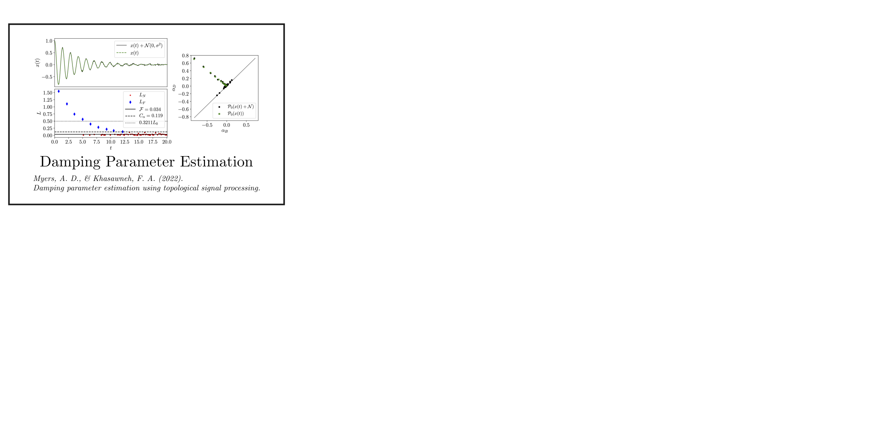
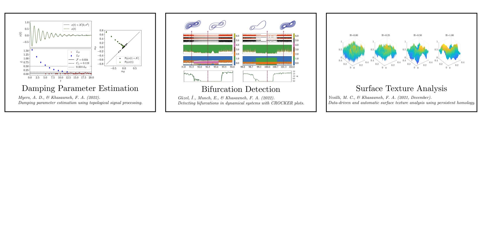
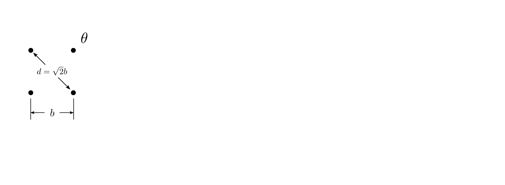
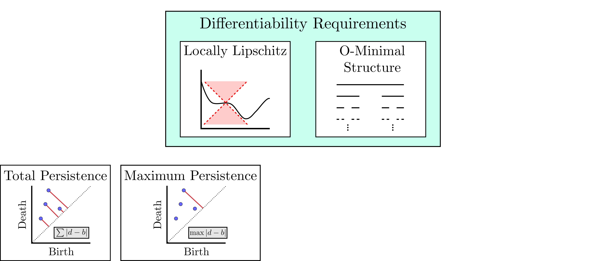
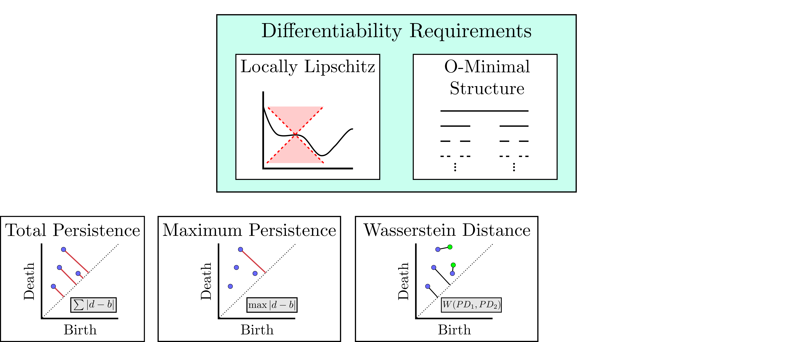
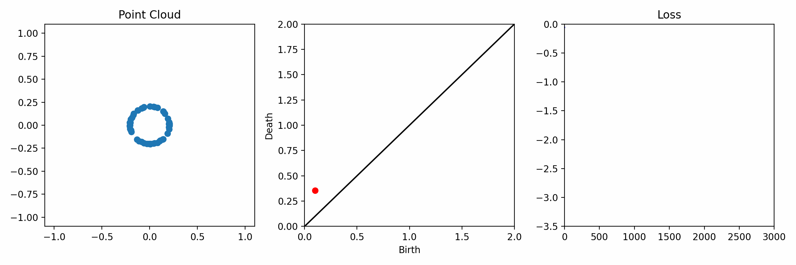
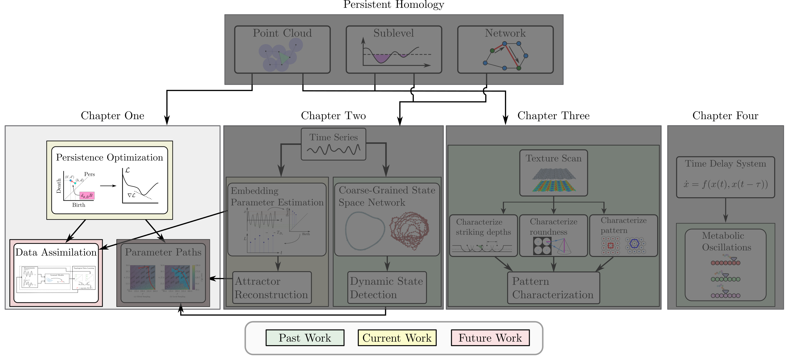
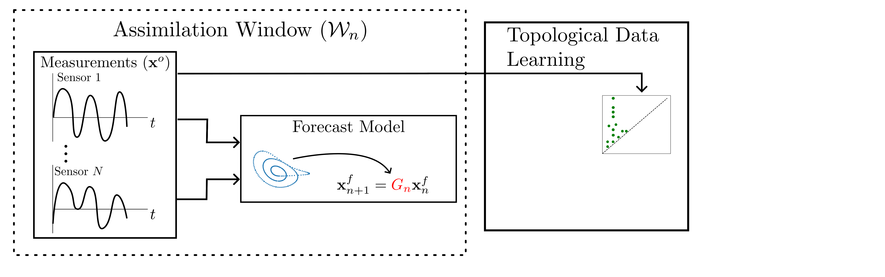
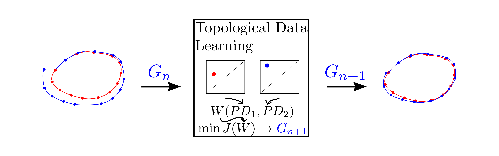

background-image: url(https://upload.wikimedia.org/wikipedia/en/5/53/Michigan_State_University_seal.svg)
background-position: 10% 95%
background-size: 12%
class: inverse left top

# Leveraging Differentiation of Persistence Diagrams for Data Assimilation

### **Max Chumley** <br> &mdash; <br> Mechanical Engineering<br><br>Computational Mathematics<br>Science and Engineering<br> &mdash;<br>Date: 6-4-24

<!-- ------------------------------------------------------- -->
<!-- DO NOT REMOVE -->
```{r setup, include=FALSE}
library(knitr)
options(htmltools.dir.version = FALSE)
knitr::opts_chunk$set(echo = FALSE)
knitr::opts_chunk$set(fig.align = 'center')
```
<!-- ------------------------------------------------------- -->


<!-- SET TITLE IMAGES HERE -- NOTE: :img takes 3 arguments: (width, left, top) to position the graphic.-->


???
Good morning, for those that I haven't met yet I am a mechanical engineering and computational math science and engineering PhD candidate at michigan state university. I am one of the AFRL scholars interns for the summer working with David Bilyeu and Adrian Wong. 

Today I will be presenting on some of my proposed work for my thesis on a new data assimilation algorithm using topological data analysis. 


---
# Acknowledgements 


???
I would like to start by thanking the national science foundation for funding this work. So far this work has been developed in collaboration with my advisor at MSU, Firas Khasawneh. 

---
# Road Map


???
Here is an overview of my research. 

Overall, my work is focused on using tools from Topological Data Analysis, in particular persistent homology, for the analysis of dynamical systems and time series data. My work is organized into the four chapters shown here with chapters 1 and 2 being the focus of my thesis and chapters 3 and 4 being more tangential projects.  

This talk will focus on the branch highlighted in red here but I am happy to discuss my other work another time.

I will start with an overview of the required background from topological data analysis and then show how to optimize functions of persistence to be used in the data assimilation algorithm.

--


---
# Simplicial Complex and Homology


???
Topological data analysis is a field that is focused on extracting shape or global structure information from data. 

Data can come in many forms and one common representation is a point cloud in R^n. You can think of these points as the state space or measurements from a dynamical system.

The goal is to analyze the shape of this point cloud to draw conclusions about the underlying system that generated the data. To analyze shape we can look at a simplicial complex induced on the point cloud by fixing a connectivity parameter r and adding edges or 1-simplices when the euclidean distance between any two points is less than 2r and adding faces or 2-simplices when this is true for any set of three points. This concept can also be generalized to higher dimensional simplices. Here I have illustrated a simplicial complex called the Vietoris Rips complex but other simplicial complexes also exist. 

Once we have a simplicial complex induced on the data, we can say something about its shape by computing its homology. Homology gives a measure of structure in different dimensions. For example, in the figure here there is a 0D homology class as a connected component and a 1D homology class as a loop that has not closed in the simplicial complex. We can also have higher dimensional homology such as 2D which quantifies voids and so on. 

It is difficult to choose the connectivity parameter that will result in optimally extracting topological information from the data. To avoid this choice, we instead study a changing simplicial complex or filtration where each successive complex includes the previous. Quantifying how the homology changes with respect to the connectivity parameter is called persistent homology. 

--

--


---
# Persistent Homology - Point Cloud


???
We track the birth and death of homology classes in a persistence diagram by plotting the value of the connectivity parameter where that class is born as its x coordinate and the value where it dies as the y coordinate. 

It is helpful to imagine this process as centering a circle at each point in the point cloud and varying the radius of the circles to generate the persistence diagram. 

Here the data has a large loop structure with some noise.  Vary the radius of the circles, we have one persistence pair that is far from the diagonal and five other loops that are close to the diagonal meaning their birth and death times are close. 

The features close to the diagonal are often attributed to noise in the data and points far from the diagonal indicate prominent structures. 

--


--


---
# Advantages of Persistence


???
Computing persistent homology has many advantages. It provides a compressive summary of shape for the data by allowing for representing complex structures as a list of few points. 

It has also been proven that persistence is stable under small perturbations, and is robust to noise where structures due to noise show up near the diagonal. Finally, it is conducive to machine learning allowing for topological features of the data to be integrated into an ML pipeline. 

--


.footnote[
     <p style="font-size: 13px;">Cohen-Steiner, et al. "Stability of persistence diagrams." Proceedings of the twenty-first annual symposium on computational geometry. 2005.<br></p>
     ]

--

--


---
# Some Applications of Persistence




???
Persistence has been successfully applied across many domains such as damping parameter estimation, bifurcation detection, surface texture analysis, chatter detection in machining, quantifying topology of different weather patterns, and stochastic bifurcation detection in dynamical systems. These are only a few of the many other applications of persistence. 

All of this success has been achieved in the absence of a calculus on the space of persistence diagrams. Recently, a framework for differentiation of persistence diagrams has been introduced that unlocks an entirely new class of problems that can be solved using persistence.  

--

--

--

--

--


---
# Differentiability of Persistence Diagrams


???
This leads to my first chapter on persistence optimization. Here I will discuss the background on how a persistence diagram is differentiated and optimized.


---
# Persistence as a Map



???
To study the idea of differentiability in the space of persistence diagrams it is useful to think of persistence as a map. If I start with a point cloud theta, I can map this point cloud to the persistence diagram using the relevant filter function. 

The persistence diagram can then be mapped to a real valued feature or function of persistence with the map V. Here I am showing the total persistence feature which quantifies how far points are from the diagonal. 

Together, the maps B and V can be composed to form a map composition from point cloud to persistence feature. 

--


.footnote[
  <p style="font-size: 13px;">Leygonie, Jacob, Steve Oudot, and Ulrike Tillmann. "A framework for differential calculus on persistence barcodes." Foundations of Computational Mathematics (2021): 1-63.</p>
  ]

--

--


---
# Functions of Persistence


.footnote[
  <p style="font-size: 13px;">Carriere, Mathieu, et al. "Optimizing persistent homology based functions." International conference on machine learning. PMLR, 2021.</p>
]

???
There are many different functions of persistence that can be used to quantify and optimize various topological properties of a point cloud and we can define new functions to enforce different topological properties. In order to have differentiability in this pipeline, these two criteria need to be satisfied. Essentially if the function is well behaved the derivative is definable.

I will now show a few useful examples of persistence functions. 

First we have the total persistence or the sum of the lifetimes of all persistence features. Maximizing this function would result in a point cloud with large distances between points in 0D persistence or large loops in 1D persistence. 

The second function of persistence is the maximum persistence which allows for controlling the largest distance between any two points in 0D persistence or the size of the largest loop in the data for 1D persistence. 

There are also methods for quantifying dissimilarity between two persistence diagrams. The wasserstein distance uses an optimal matching between persistence diagrams to to give a notion of distance between them. This can be used to reach a point cloud that gives a target persistence diagram by minimizing the wasserstein distance. 

Lastly, persistent entropy gives a measure of order in the persistence diagram and can be used to control the simplicity of a point cloud and when used in combination with other persistence functions can give a simpler solution to the optimization problem. 


--

--

--

--


---
# Persistence Optimization


???
So if I define a loss function in terms of a function of persistence, its gradient can be computed to minimize that loss function and optimize for different topological properties of the data. 

I am skipping the details on how the gradient is defined but it can be computed numerically using the Gudhi python library and tensorflow to perform the gradient descent optimization. 

Now i'll show an example. I defined a loss function using these two terms. The first term is the opposite of the total persistence so by minimizing L we are promoting larger loops in the point cloud and 1D persistence diagram. The second term is a regularization term to promote points remaining within a 2x2 square of space. 

If I start with a circular point cloud, performing the optimization results in a point cloud consisting of a large loop and we see that the persistence pair moves in the vertical direction.  

--

--

--


.footnote[Carriere, Mathieu, et al. "Optimizing persistent homology based functions." International conference on machine learning. PMLR, 2021.
]

---
# Data Assimilation



???
I will now move into my proposed data assimilation framework through the lens of persistence optimization. 


---
# Random Feature Map Forecasting


.footnote[Rahimi, A., & Recht, B. (2007). Random features for large-scale kernel machines. Advances in neural information processing systems, 20.]

???
Data assimilation requires a model for the system to optimally combine measurements and model predictions. The goal of this project is to utilize data driven models. There are many methods to obtain a model from data and the method I have focused on so far is called random feature map forecasting. 

This method works by assuming we have a D dimensional unknown dynamical system.

It is assumed that we are only able to obtain noisy observations of the true underlying system. U^o_n is the observation at the nth step and U_n is the true state. Gamma is the measurement covariance matrix and eta is the noise vector.

The idea with random feature map forecasting is that we start in a D dimensional space from the measurements and use random feature maps to move to a higher dimensional space with reservoir dimension Dr. The tanh function was used in this work but in general any activation type function that is a function of the weights and bias in this form will work. The weight matrix and bias vector are drawn from uniform distributions and fixed for the training process. 

These feature vectors exist in a Dr dimensional space and the goal is to learn surrogate model coefficients W_LR in this space using linear ridge regression. These model coefficients form a map from the random feature space to the state space of the system and this map is then used to predict future system states. 

In the presence of measurement noise or chaos, these models tend to deviate from the measurements after some time. 

--

--

--

--

--

--

--


---
# Data Assimilation Overview


???
To optimize the forecast horizon, a concept called data assimilation is used. With data assimilation it is assumed that there is a model for the system that could be obtained from forecasting, and here is a plot of what the model result may look like. 

If measurements are taken from the system, there are associated uncertainties and these measurements contain useful information for updating the forecast model. The true system state could be the green curve here.

In data assimilation, the forecast results are updated based on the difference between the forecast and the measurement result scaled by a gain matrix K. This gain matrix comes from minimizing a cost function to minimize the model and measurement discrepancies based on the respective covariance matrices. This estimation x_a is typically referred to as the analysis. 

Initially, the model is taken to be the optimal estimation and once a measurement is taken, the model result is updated to be closer to the true system state. As more measurements are taken, the estimation improves and you could imagine that for a high enough sampling rate this would essentially be a continuous curve.

--

--

--

--

--

--

--

--


---
# Topological Data Assimilation


???
For my project I am developing a new algorithm to use topological data analysis and persistence optimization for data assimilation. 

This method will work by assuming that we have N signal observations with additive noise. 

These measurements are then used for generating a surrogate model.

I will then compute persistence on the measurement data and compute persistence on the forecast model. 

Using the wasserstein distance, the dissimilarity between these two diagrams can be quantified and persistence optimization can be used to optimally adjust model coefficients to minimize the wasserstein distance between them. 

This will give an updated model that has gives a forecast with a persistence diagram that is closer to the measurement persistence diagram. 

The new model makes up the analysis which is fed back into the loop to be used as the model in the next assimilation window to make a new prediction and the process is continued as new observations stream in. 

When the optimization finishes the resulting model G_hat is the optimal surrogate model. 

The goal is to tune the surrogate model coefficients to minimize topological differences between the measured and model results without specifying noise statistics from the measurements. 

--

--

--

--

--

--

--

--


---
# Preliminary Results (Chaotic Lorenz)

- 0D + 1D persistence
- Noise amplitude $\eta=0.01$


???
I generated preliminary results using simulations of the chaotic lorenz system with additive noise. I used the random feature map forecasting method to obtain a surrogate model from the data shown in red and the measurements are shown in blue. 

We can clearly see that the model follows the data in some regions but in other regions it has a completely different shape. 

If I apply the data assimilation algorithm using TDA by adjusting the model parameters to minimize the wasserstein distance, we see that the model ends up much closer to the measurements.

Here I plotted the states with respect to time and you can clearly see the improvement in the optimal solution when compared to the original forecast in green. 


--

--


---

# Preliminary Results (Chaotic Lorenz)

- 0D + 1D persistence
- Noise amplitude $\eta=0.1$


???
I also ran the same optimization for a larger noise amplitude so we can see how it performs. 

And here are the time series signals for the larger noise amplitude. 

Both results performed similarly, but I want to point out that I am still working to understand this method. These results required a lot of tweaking and I needed to use extremely small learning rates around 10^-7 to ensure that the model did not destabilize and I am working to determine the best optimization settings to get this to work in a more general case. 


--


---
# Summer Research Plans


???
I will summarize with a slide outlining my research plans for this summer internship. The goal of my project is to take a high dimensional system with many different states and perform dimensionality reduction on that data to reduce the data to its primary structures. 

I will then use different data driven modeling approaches to obtain a model from the reduced data and attempt to reconstruct the original signals and I will use the topological data assimilation algorithm to further improve the model prediction accuracies. 

This pipeline will then be validated on Hall effect thruster data.


--

--

--

--

--


---
# Thank you! 


.footnote[
<p style="font-size: 15px;">1. <b>Chumley, M.M.</b>, Yesilli, M.C., Chen, J, Khasawneh, F. A., & Guo, Y.,
<b>"Pattern characterization using topological data analysis: Application to piezo vibration striking treatment"</b>, Precision Engineering, Volume 83, 2023. <i>[Editor's Recommendation]</i></p>

<p style="font-size: 15px;">2. Yesilli, M.C., <b>Chumley, M.M.</b>, Chen, J, Khasawneh, FA, & Guo, Y. <b>"Exploring Surface Texture Quantification in
Piezo Vibration Striking Treatment (PVST) Using Topological Measures.”</b> Proceedings of the ASME 2022 17th
International Manufacturing Science and Engineering Conference.</p>

<p style="font-size: 15px;">3. <b>Chumley, M.M.</b>, Khasawneh, F.A., Otto, A. et al. <b>"A Nonlinear Delay Model for Metabolic Oscillations in Yeast Cells"</b>. Bull Math Biol 85, 122 (2023). https://doi.org/10.1007/s11538-023-01227-3</p>

<p style="font-size: 15px;">4. Myers, A. D., <b>Chumley, M. M.</b>, Khasawneh, F. A., & Munch, E. (2023). <b>"Persistent homology of coarse-grained state-space networks."</b> Physical Review E, 107(3), 034303.</p>

<p style="font-size: 15px;">5. Myers, A. D., <b>Chumley, M. M.</b>,& Khasawneh, F. A. (2024). <b>"Delay parameter selection in permutation entropy using topological data analysis."</b>  La Mathematica, Accepted.</p>
]


???
Thank you for your attention. You can find my papers and slides on my website maxchumley.com. I publish my code on our teaspoon python library and I plan to implement more libraries for my future work. 

I also have mini tutorial content from the SIAM DS mini tutorial on topological signal processing that I helped organize and present last year. The git repo can be accessed with the QR code. 

Are there any questions?