class: inverse left top

# Linewidth Reduction Update

### **Max M. Chumley Ph.D.** <br> &mdash; <br> Postdoctoral Research Fellow<br><br>Optics and Photonics<br> &mdash;<br> University of Michigan

<span style="font-family: 'IBM Plex Sans', sans-serif; font-size: 1.2em; color: #FFCB05;"> <span id="current-date"></span></span>
<script>
  var d = new Date();
  var dateStr = (d.getMonth()+1) + "/" + d.getDate() + "/25";
  document.getElementById('current-date').textContent = dateStr;
</script>

<!-- ------------------------------------------------------- -->
<!-- DO NOT REMOVE -->
```{r setup, include=FALSE}
library(knitr)
options(htmltools.dir.version = FALSE)
knitr::opts_chunk$set(echo = FALSE)
knitr::opts_chunk$set(fig.align = 'center')
```
<!-- ------------------------------------------------------- -->

```{r xaringan-tile-view, echo=FALSE}
xaringanExtra::use_tile_view()
```


<!-- SET TITLE IMAGES HERE -- NOTE: :img takes 3 arguments: (width, left, top) to position the graphic.-->

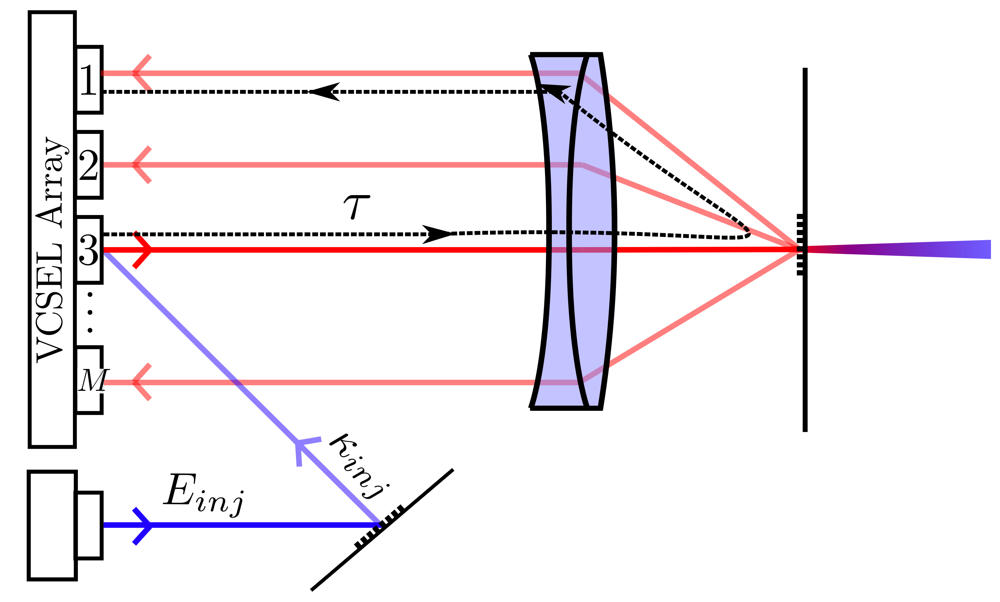

<div class="seal-box"></div>

???
Title Script

<!-- ---
# Acknowledgements 


???
Script:  -->

<!-- ---
# Vertical Cavity Surface Emitting Lasers (VCSELs)

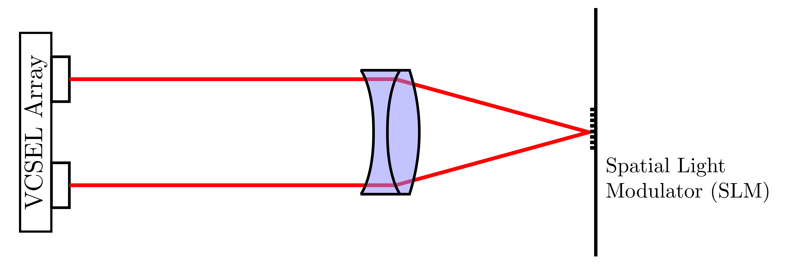 -->

---
# Updates


- Linewidth results

--

  - $\phi_p$ Dependence

--

  - 2 Lasers

--

  - 3 Lasers

--

  - $T_{max}$ Convergence

--

- Estimating $\kappa_{th}$ 

  - Fitting GMD to $\kappa$


---
# Linewidth Results (MURI Review)


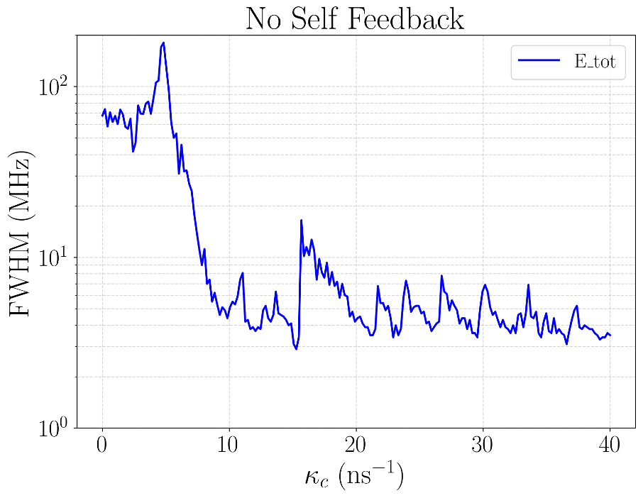

--

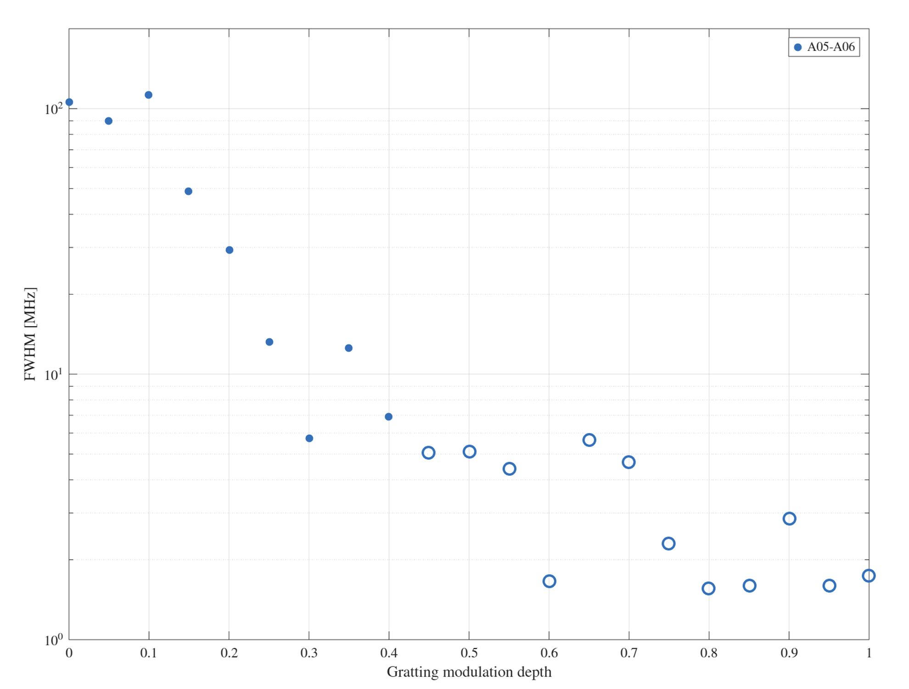

---
count: false
# Linewidth Results (MURI Review)

- Results seem to match fairly well

- Issue

  - Previous linewidth estimates were based on the intensity/RF spectrum,
    $|\mathcal{F}(|E(t)|^2)|$.

  - For the optical linewidth of the full field, we should instead use the
    field spectrum, $|\mathcal{F}(E(t))|^2$.

  - The intensity spectrum removes the optical phase information


---
# Coupling Matrix Definition ($M$ lasers)


- $\boldsymbol{\kappa}_c = \kappa_cA$

  - $\kappa_c$ is the overall coupling budget

--

- $A\in\mathbb{R}^{M\times M}$ with $\sum A_{ij} = 1$ and $A=A^T$ 


--

- All-to-all coupling, no self-coupling $A=\frac{1}{M(M-1)}(\mathbf{1}_{M\times M}-\mathbf{I}_{M\times M})$

  - For $M=2$ lasers, $A=\frac{1}{2}\begin{bmatrix} 0 & 1 \\ 1 & 0 \end{bmatrix}$

  - For $M=3$ lasers, $A=\frac{1}{6}\begin{bmatrix} 0 & 1 & 1 \\ 1 & 0 & 1 \\ 1 & 1 & 0 \end{bmatrix}$


---
# 2 Laser Linewidth Estimation


---
# 2 Laser Linewidth Estimation (4 GHz)

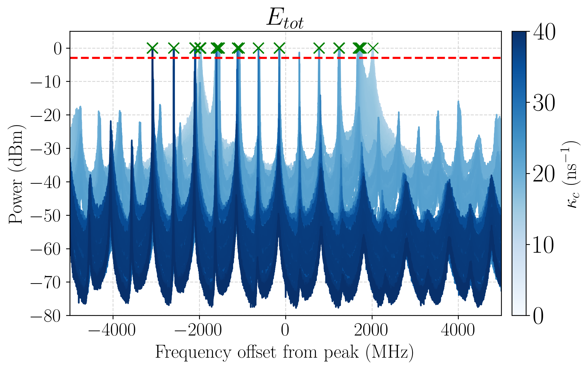

--

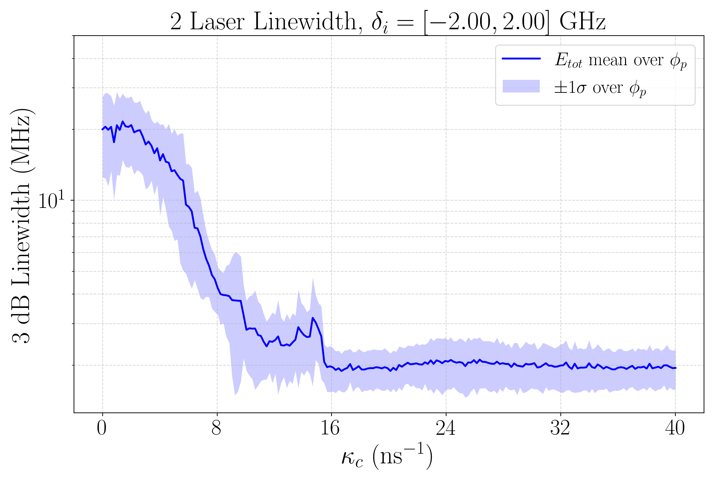

--

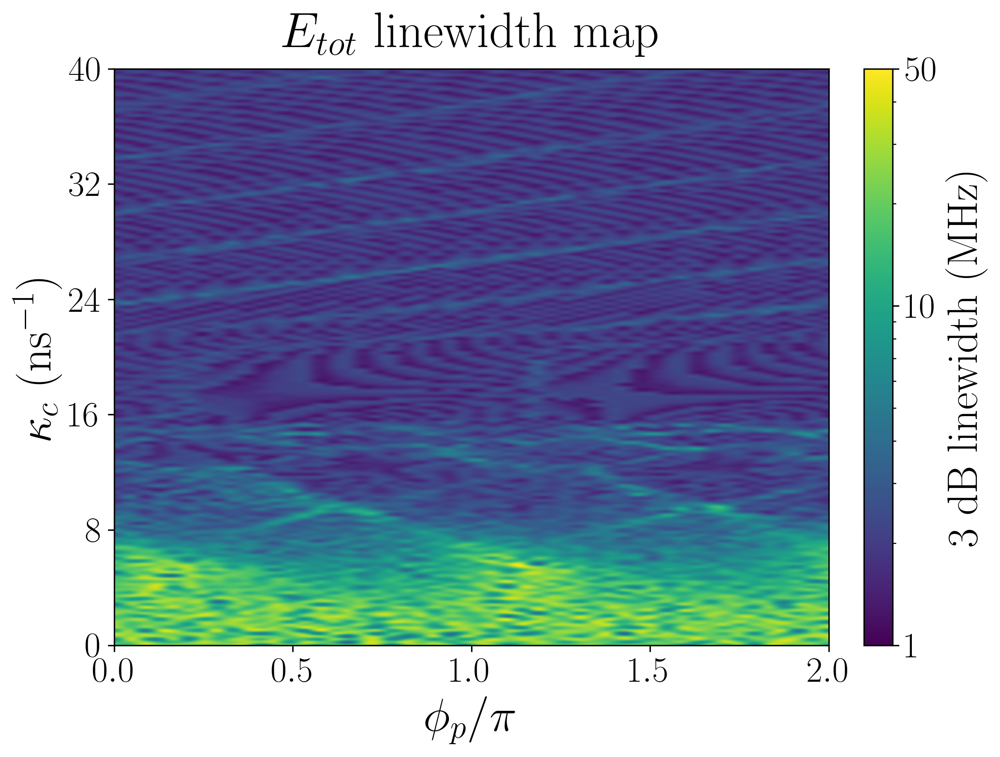

---
# 3 Laser Linewidth Estimation


---
# 3 Laser Linewidth Estimation (4 GHz)

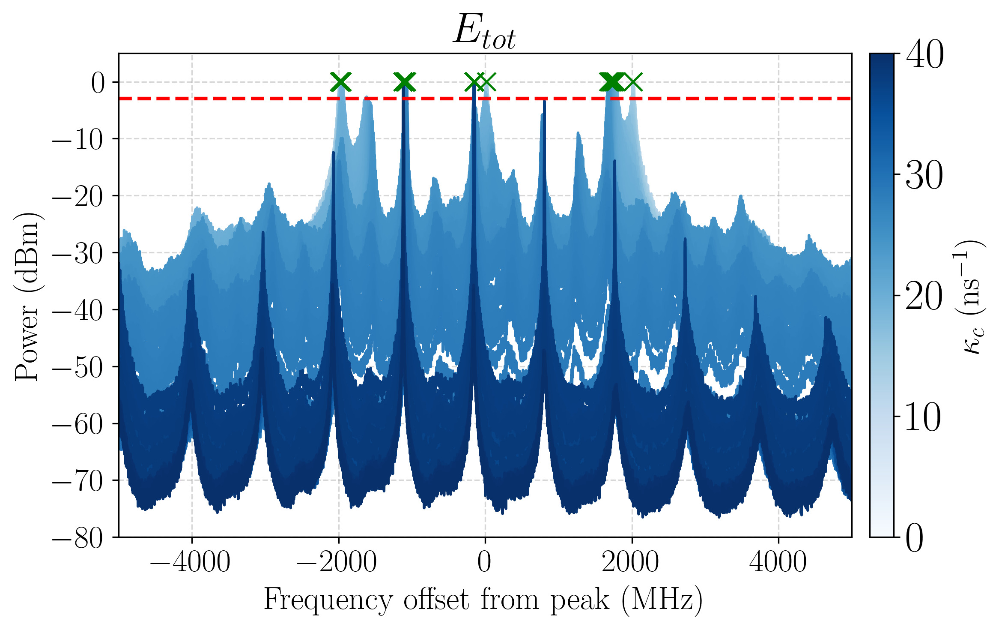

--

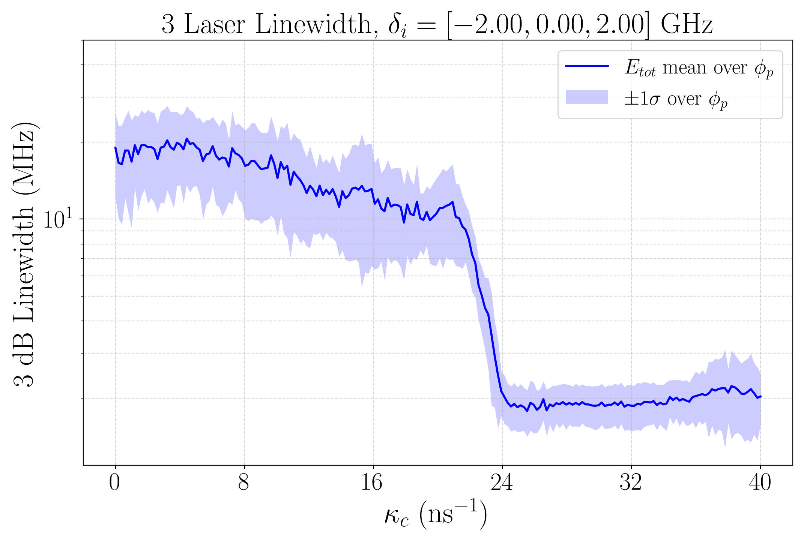

--

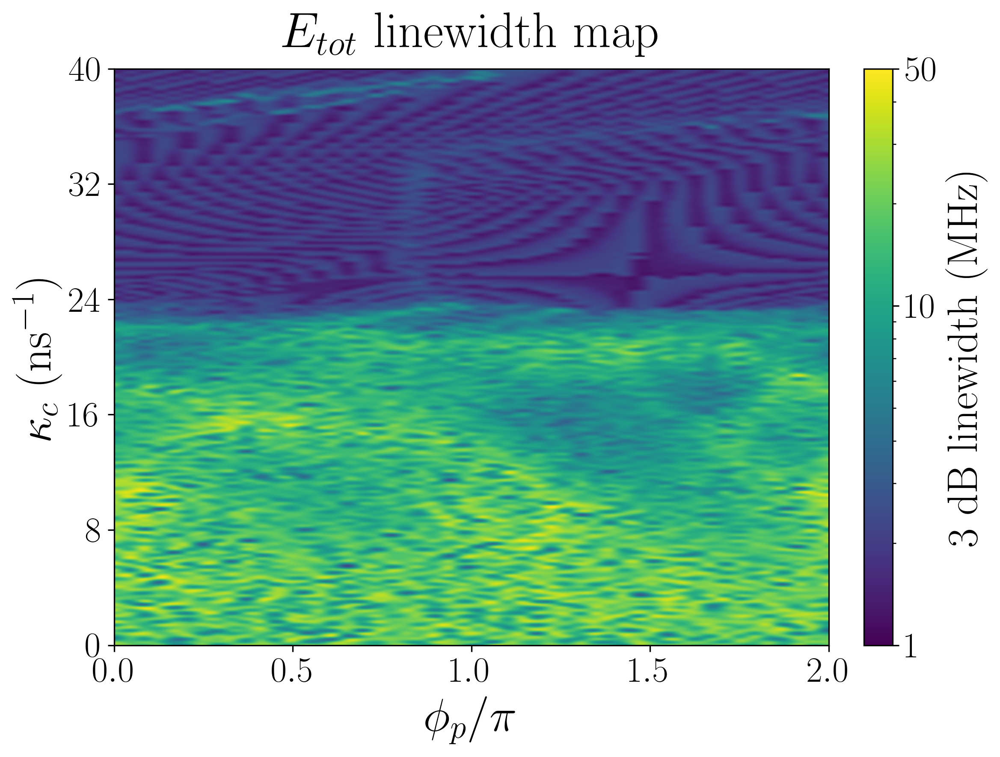


---
# $T_{max}$ Convergence


- Linewidths computed with $T_{max}=1~\mu\mathrm{s}$

--

- FFT bin resolution: $\Delta f = 1/T_{max} = 1$ MHz

--

- Compute linewidths for $T_{max}\in[0.2,5]~\mu\mathrm{s}$

--

- Maximum resolution: $\Delta f = 1/(5\mu\mathrm{s}) = 200$ kHz

--


---
count: false
# $T_{max}$ Convergence


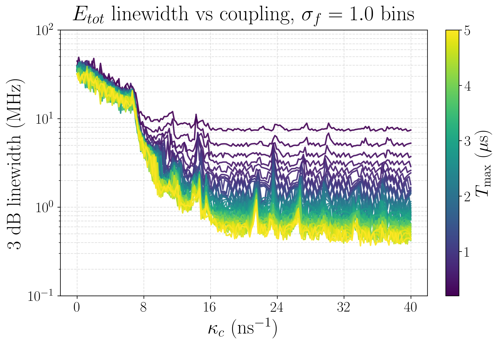

--

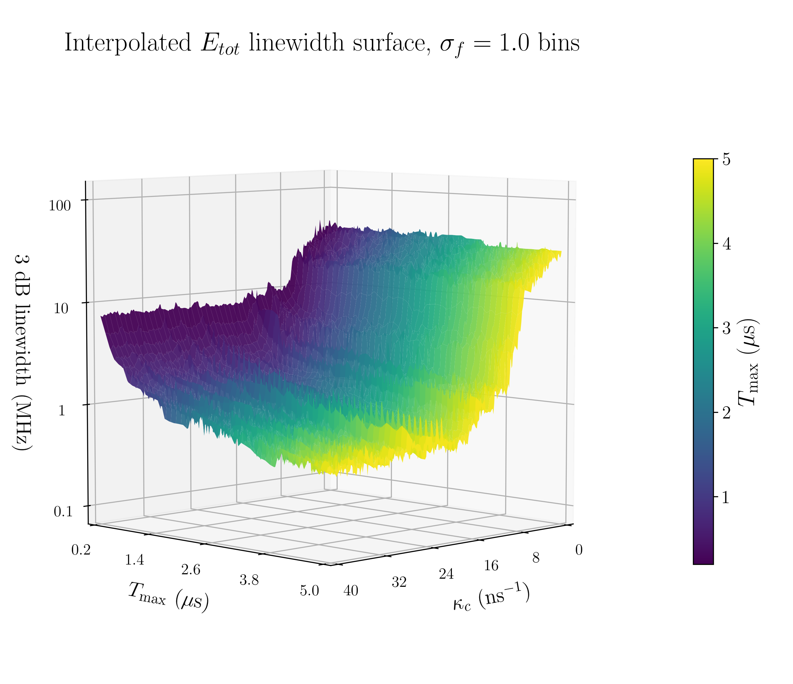


---
count: false
# $T_{max}$ Convergence


- Claims <100 Hz linewidth (20,000 $\mu\mathrm{s}$!!)

.footnote[Ma, W., Xiong, B., Sun, C., Ke, X., Wang, J., Hao, Z., ... & Luo, Y. (2019). Linewidth narrowing of mutually injection locked semiconductor lasers with short and long delay. Applied Sciences, 9(7), 1436.]

--

- Intrinsic linewidth inferred

  - White noise floor computed from PSD

--

- Noise floor $Hz^2/Hz$ $\to$ Linewidth $Hz$

- Lorentzian linewidth $\Delta\nu = \pi S_{\nu}(f)$

- <b>Not from optical spectrum</b> 

---
# $\text{GMD}\to\kappa$


- Previous estimate of $\kappa_{th}$ was based on equilibrium points

--

- Noise changes the system

--

- Need to estimate $\kappa_{th}$ using system with noise to compare to experiment (GMD)

--

- Goal: Compute $\kappa_{th}$ as a function of detuning

--

- Use order parameter to determine $\kappa_{th}$

---
count: false
# Estimating $\kappa_{th}$ with Noise

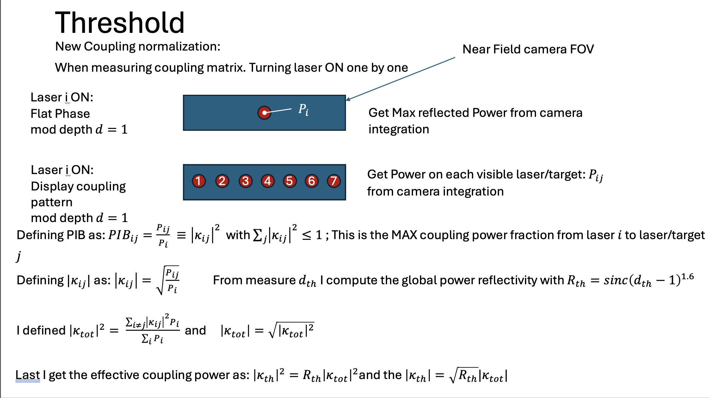

--

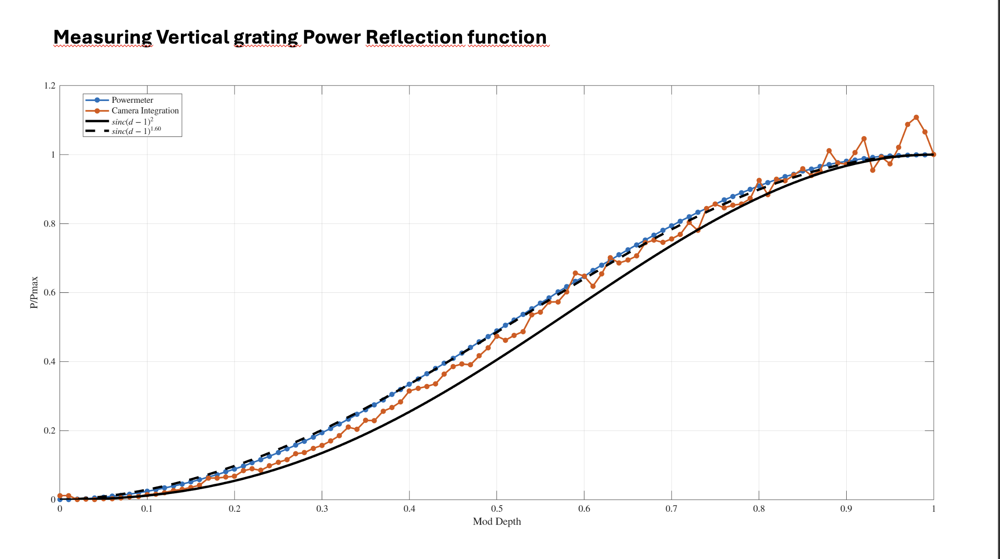


---
count: false
# Estimating $\kappa_{th}$ with Noise

- Approach: Vary detuning $0\to 5$ GHz, and for each detuning, vary $\kappa$ to find the point where the order parameter goes above 0.7

--

- Threshold Coupling Fraction: $R_{th} = \mathrm{sinc}(d_{th}-1)^{q}$, $q\in[1.6,2]$

--

- $|\kappa_{th}| = \sqrt{R_{th}}|\kappa_{c}|$

--

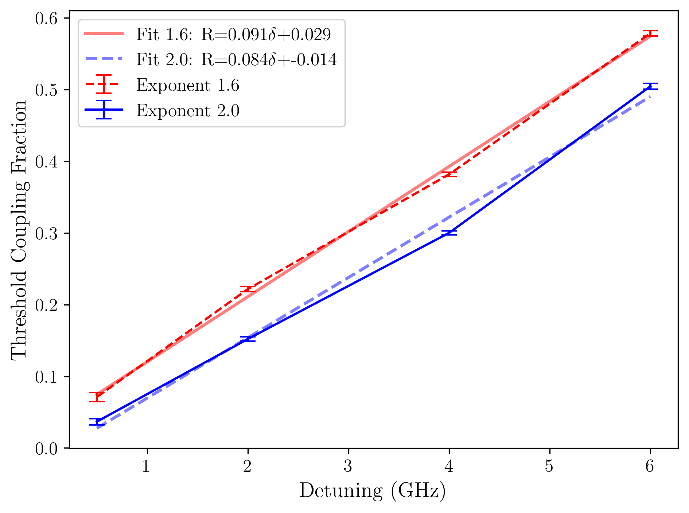

--

- Maximum $\delta=10.68$ GHz $~(d_{th}=1,~q=1.6)$


---
count: false
# Estimating $\kappa_{th}$ with Noise


---
count: false
# Estimating $\kappa_{th}$ with Noise

- Approach: Vary detuning $0\to 5$ GHz, and for each detuning, vary $\kappa$ to find the point where the order parameter goes above 0.7

- Plot order parameter map over $\kappa$ and detuning

--

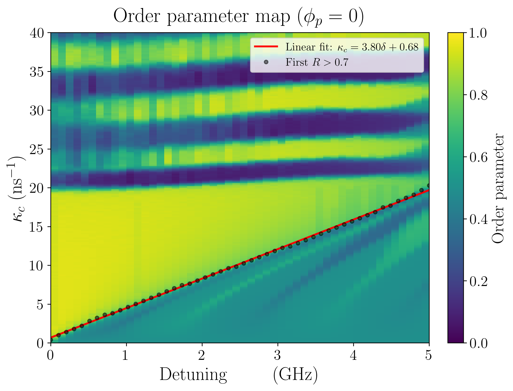


--

- Use maximum detuning (10.68 Ghz)
- $\kappa_{max}=41.26$ $ns^{-1}$


--

- Solve $\sqrt{R_{1.6}} = \frac{\kappa_c}{\kappa_{\max}}$

- $R_{1.6} = \mathrm{sinc}(d_m-1)^{1.6}$

- To get $\kappa_{c}=f(d_{m})$


---
# Comparing to Experiment

- $\kappa_{th} = 3.8\delta + 0.68$ (Simulation)


--


- $\sqrt{\mathrm{sinc}(d_{th}-1)^{1.6}} = 0.091\delta + 0.029$ (Experiment)

--

$\implies\kappa_{th} =41.75\sqrt{\left(\mathrm{sinc}(d_{th}-1)^{1.6}\right)}-0.531$

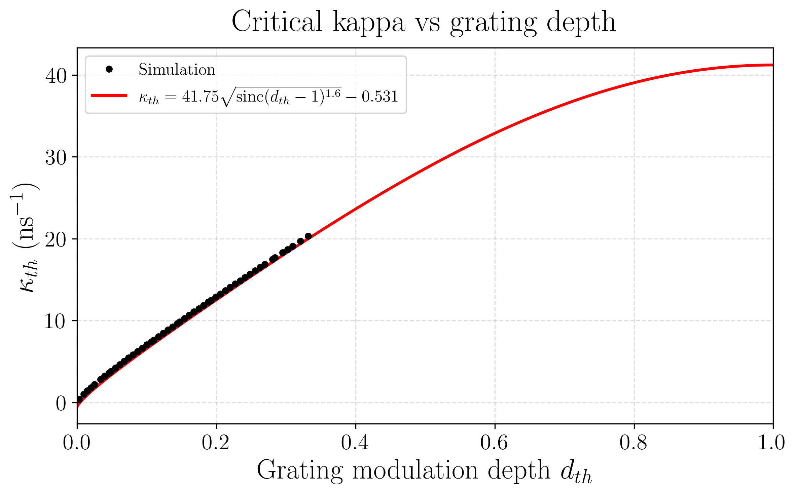

---
# Comparing to Experiment (0.5 GHz)

- Experimentally: $d_{th} = 0.0355$


--

- $\kappa_{th} = 2.58$ $ns^{-1}$ (Simulation)


--

- $\kappa_{th} = 2.44$ $ns^{-1}$ (Predicted)

---
# Comparing to Experiment (2 GHz)

- Experimentally: $d_{th} = 0.1355$


- $\kappa_{th} = 8.28$ $ns^{-1}$ (Simulation)


- $\kappa_{th} = 8.72$ $ns^{-1}$ (Predicted)

---
# Comparing to Experiment (4 GHz)

- Experimentally: $d_{th} = 0.25$


- $\kappa_{th} = 15.88$ $ns^{-1}$ (Simulation)


- $\kappa_{th} = 15.41$ $ns^{-1}$ (Predicted)

---
# Comparing to Experiment (6 GHz)

- Experimentally: $d_{th} = 0.4$


- $\kappa_{th} = 23.48$ $ns^{-1}$ (Simulation $^*$)


- $\kappa_{th} = 23.62$ $ns^{-1}$ (Predicted)


---
# Next Steps


- $T_{max}$ convergence with 3 lasers


--

-  Self feedback ($\tau$) and secondary self feedback ($2\tau$)


--

- Test $\kappa_{th}$ predictions up to maximum detuning (10.68 GHz)


--

- Intrinsic linewidth estimation


--

- Coupling topology?


