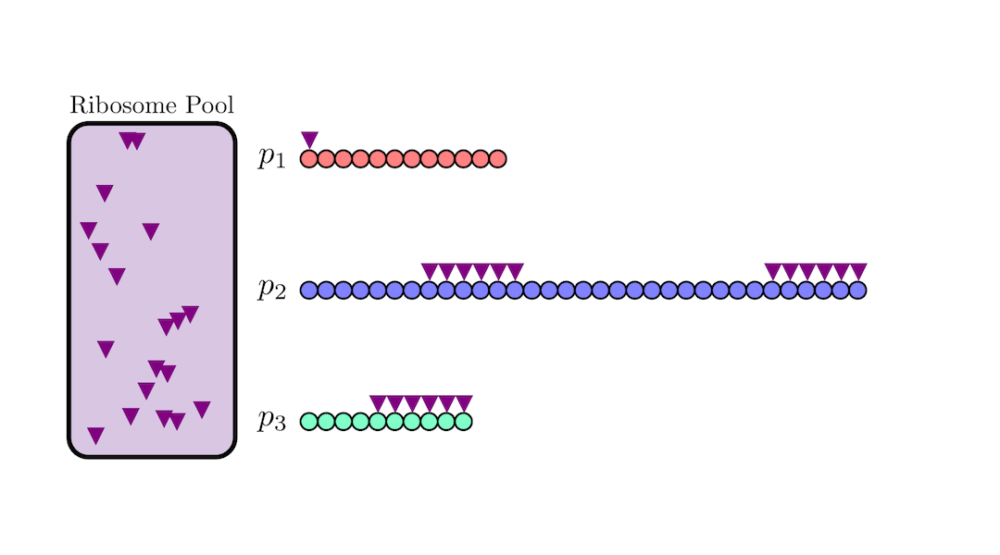
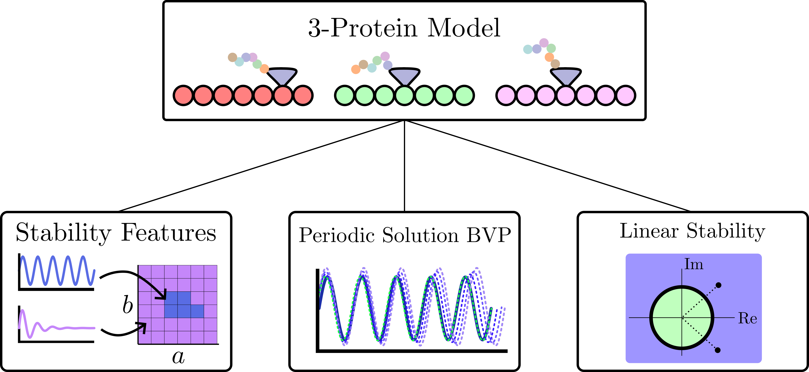
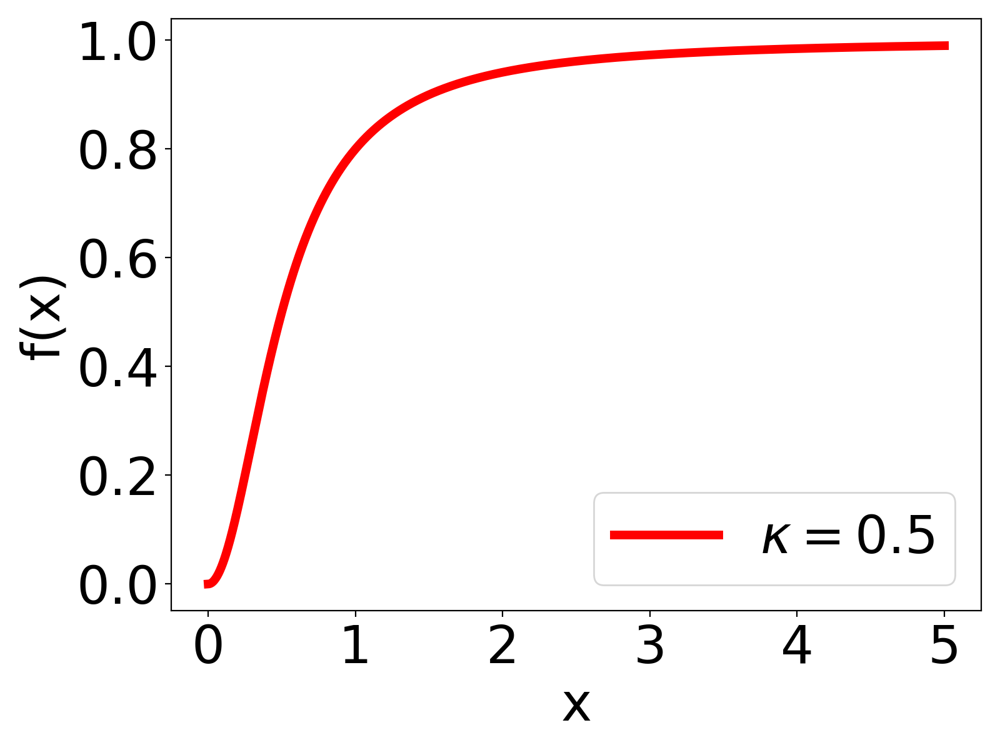

background-image: url(https://upload.wikimedia.org/wikipedia/en/5/53/Michigan_State_University_seal.svg)
background-position: 10% 95%
background-size: 12%
class: inverse left top

# Title

### **Name** <br> &mdash; <br> Mechanical Engineering<br><br>Computational Mathematics<br>Science and Engineering<br> &mdash;<br> Michigan State University

### Date: 2-16-24

<!-- ------------------------------------------------------- -->
<!-- DO NOT REMOVE -->
```{r setup, include=FALSE}
library(knitr)
options(htmltools.dir.version = FALSE)
knitr::opts_chunk$set(echo = FALSE)
knitr::opts_chunk$set(fig.align = 'center')
```
<!-- ------------------------------------------------------- -->


<!-- SET TITLE IMAGES HERE -- NOTE: :img takes 3 arguments: (width, left, top) to position the graphic.-->


???
Title Script

---
# Acknowledgements 


???
Script: 
I would like to start by thanking the air force office of  scientific research for funding this project. I would also like to thank my collaborators ...

---

# Animation Example

<!--  -->


???
Script: 
An essential component in living cells is the ability to make proteins for the organism. This mainly occurs through protein synthesis in the cell where a pool of ribosomes utilize resources in the cell and traverse the messenger ribonucleic acid or mRNA strands. These strands contain the necessary code for synthesizing a protein and the ribosomes read this code to make the protein as the mRNA is traversed. 

It has been observed in experimental settings that when the cell is starved of resources it will exhibit metabolic cycling where the protein production rates oscillate. 

We aimed to model this process as a time delay system due to the metabolic cycling process taking approximately 40 minutes in experiments. 

This animation demonstrates ribosomes traversing the mRNA for three proteins and when they reach the end the protein is produced.


---
# Clicky Example


--
    


???
Script: 
Here is an outline for my talk today. I will show how we obtained a single protein model and show the three methods that we used for searching for limit cycles in this system.

I will then show how we extended the model to include three coupled proteins with a shared resource pool and apply the same methods for analysis.

---
class: left
# Bulleted List Example

- Ribosome Initiation: $\mu(t)=f(p(t))R(t)$

--



- Hill Function: $f(x)=\frac{x^n}{\kappa^n+x^n}$

--

- $\dot{p}(t) = B\mu(t-\tau) - Dp(t)$

--

- $R(t) = R_T - A\int_{t-\tau}^t\mu(s)ds$ $^1$

.footnote[1.L. M. y Ter ́an-Romero, M. Silber, and V. Hatzimanikatis, “The origins of time-delay in template biopolymeriza-
tion processes,” PLoS Computational Biology, vol. 6, p. e1000726, apr 2010]
--

- $\dot{R}(t) = A(f(p(t-\tau))R(t-\tau) - f(p(t))R(t))$

--

Single Protein System:
\begin{align}
  \dot{p}(t) &= Bf(p(t-\tau))R(t-\tau) - Dp(t),\\
  \dot{R}(t) &= A(f(p(t-\tau))R(t-\tau) - f(p(t))R(t))
\end{align}

???
Script: 
We will now discuss how we obtained our model for this system. 
The rate of ribosome initiation is the product of the activator the f(p(t)) term and the processing  molecule or resource R(t). The activator is a hill function where if the input is sufficiently large its value approaches one and it is close to zero if the input is close to zero. The hill function parameters change the rate of initiation for the activation.  

The rate of protein production is then proportional to the initiation at some time tau seconds in the past where the delay is the required time for protein synthesis. The parameter B is the growth rate and we also include the decay term here with decay rate D.

The total resource equation has been suggested as this equation where the resource at any time t is given by the total resource minus the integral of the initiation over the production time tau. 

Differentiating this expression and using the initiation definition gives the second equation in our model and we write the single protein system as these two equations. 


---
# Thank you! Any questions?


</br></br></br></br></br></br></br></br></br></br></br></br></br></br></br></br>
**M. M. Chumley**, F. A. Khasawneh, A. Otto, and T. Gedeon, “A Nonlinear Delay Model for Metabolic Oscillations in Yeast Cells,” 2023.
(arxiv.org/abs/2305.07643)

???
Script: 
Thank you for your time, are there any questions?


